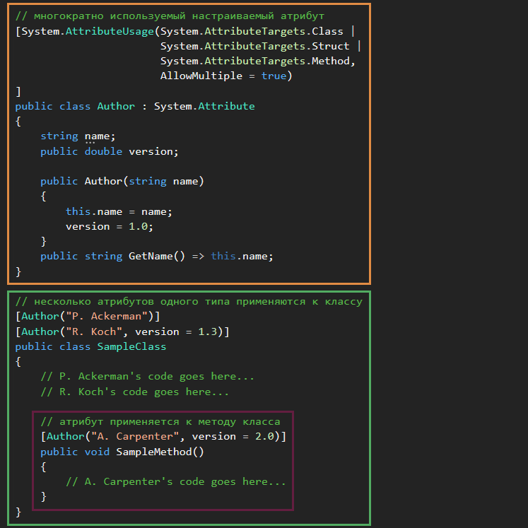

# Атрибуты

_________________________________________________________________________________________
#### Создание настраиваемых атрибутов ####

Например, требуется пометить тип тегом с именем разработчика, для этого можно определить
класс настраиваемых атрибутов ```Author```:

1. определяется класс атрибута, наследующий от ```System.Attribute```, где имя класса – это
имя атрибута ```Author```.

a. параметры конструктора являются позиционными параметрами настраиваемого атрибута
(в данном случае ```name``` позиционный параметр).

b. все открытые поля или свойства, доступные для чтения и записи, являются именованными
параметрами (в данном случае ```version``` именованный параметр).

2. используется атрибут ```AttributeUsage```, делающий атрибут ```Author``` допустимым только для класса и
объявлений ```struct```.

a. ```AttributeUsage``` имеет именованный параметр ```AllowMultiple```, выставляющий для
настраиваемого атрибута однократное или многократное использование.



*несколько атрибутов одного типа применяются к классу
_________________________________________________________________________________________
#### Обращение к атрибутам с помощью отражения ####

Отражение позволяет извлекать сведения, определённые с настраиваемыми атрибутами.
Метод ```GetCustomAttributes``` возвращает массив объектов, являющихся эквивалентами атрибутов
исходного кода во время выполнения.

В примере, представленном выше, спецификация атрибута ```Author```
```
[Author("P. Ackerman", version = 1.1)]  
class SampleClass
```
эквивалентна следующему коду:
```
Author anonymousAuthorObject = new Author("P. Ackerman");  
anonymousAuthorObject.version = 1.1;
```
Однако, код не выполняется до тех пор, пока у ```SampleClass``` не будут запрошены атрибуты.

#### Таким образом, вызов метода ```GetCustomAttributes``` в ```SampleClass``` приведет к тому, что объект ####
#### ```Author``` будет создан и инициализирован так, как показано выше. ####
Метод ```GetCustomAttributes``` возвращает объект ```Author``` и все другие объекты атрибутов в
массиве.


_________________________________________________________________________________________
