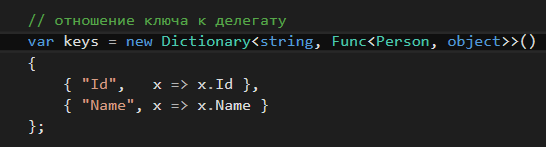

## FuncDelegate.OrderBy

* Sort data (employee info) by the selected criterion "Id", "Name" or other property.

* ”пор€дочить имеющиес€ данные (инфо о сотрудниках) по выбранному критерию "Id", "Name" или другое свойство.

## Employee info:

## Sorting criterion (keys):

