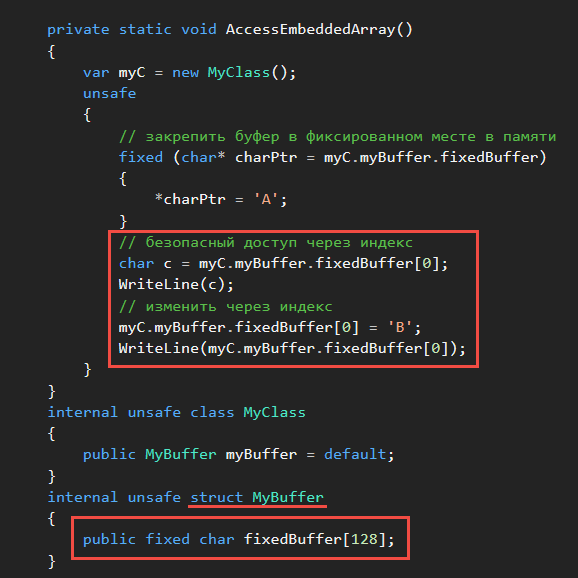

# Буферы фиксированного размера
_________________________________________________________________________________________
### Оператор ```fixed``` можно использовать для создания буфера с массивом ###
### фиксированного размера в структуре данных. ###

Оператор ```fixed``` задает указатель на управляемую переменную и "закрепляет" эту переменную
во время выполнения оператора, не позволяя сборщику мусора переносить перемещаемую
переменную.
Такие указатели на перемещаемые управляемые переменные полезны только в контексте ```fixed```.
```
unsafe
{
    double[] arr = { 3, 2.1, 0, 1.1, 4.0 };
    string str = "ABC";

    // следующие два присваивания эквивалентны
    // каждый присваивает адрес первого элемента в массиве arr указателю p

    // инициализировать указатель, используя массив
    fixed (double* p = arr) { /*...*/ }

    // инициализировать указатель, используя адрес переменной 
    fixed (double* p = &arr[0]) { /*...*/ }


    // инициализировать p, используя строку
    fixed (char* p = str) { /*...*/ }

    // следующее присваивание недопустимо, потому что
    // str[0] - это символ, являющийся значением, а не переменной
    // fixed (char* p = &str[0]) { /*...*/ }
}
```
Указатели, инициализированные в операторах fixed, являются переменными только для чтения.
Чтобы изменить значение указателя, необходимо объявить переменную второго указателя и
изменить её.
```
fixed (byte* ps = srcarray, pd = dstarray)
{
    byte* pSourceCopy = ps;
    pSourceCopy++; // указатель на следующий элемент
    ps++; // невозможно изменить ps, он объявлен в fixed
}
```
_________________________________________________________________________________________

Массив должен иметь тип ```bool```, ```byte```, ```char```, ```short```, ```int```, ```long```, ```sbyte```, ```ushort```, ```uint```, ```ulong```,
```float``` или ```double```.
```
private fixed char name[30];
```

В безопасном коде структура, содержащая массив, не содержит элементы массива.
Вместо этого в ней присутствуют ссылки на элементы.
#### Можно внедрить массив фиксированного размера в структуру, если он используется в блоке ####
#### небезопасного кода. ####

#### Для установки указателя на первый элемент используется оператор ```fixed```: ####
```
fixed (char* charPtr = myC.myBuffer.fixedBuffer)
{
    *charPtr = 'A';
}
```



*показан доступ к полям fixed, доступный после выхода C# 7.3


#### Небезопасные буферы отличаются от обычных массивов: ####

* Небезопасные буферы можно использовать в небезопасном контексте.

* Небезопасные буферы – это всегда векторы или одномерные массивы.

* В объявлении массива всегда должен присутствовать счетчик, такой как ```char id[8]```.
Использовать ```char id[]``` нельзя.

* Небезопасные буферы могут быть только полями экземпляров структур в небезопасном контексте.
