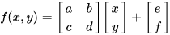
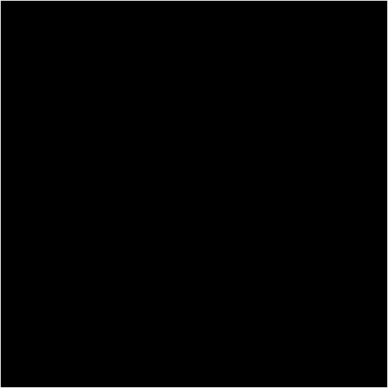

## Barnsley Fern

The fractal is one of the basic examples of self-similar sets.

* Barnsley's fern uses four affine transformations. The formula for one transformation is the following:

## Demonstration

