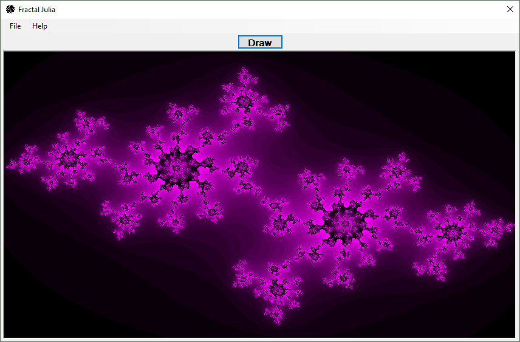

## "Fractal Julia"

The fractal is one of the basic examples of self-similar sets.
These sets are named after Gaston Julia and Pierre Fatou whose work began the study of complex dynamics during the early 20th century.

* Three-dimensional slices through the (four-dimensional) Julia set of a function on the quaternions.
_____________________________________________________________________________________________________

### Demonstration: ###

### GUI: ###

_____________________________________________________________________________________________________
