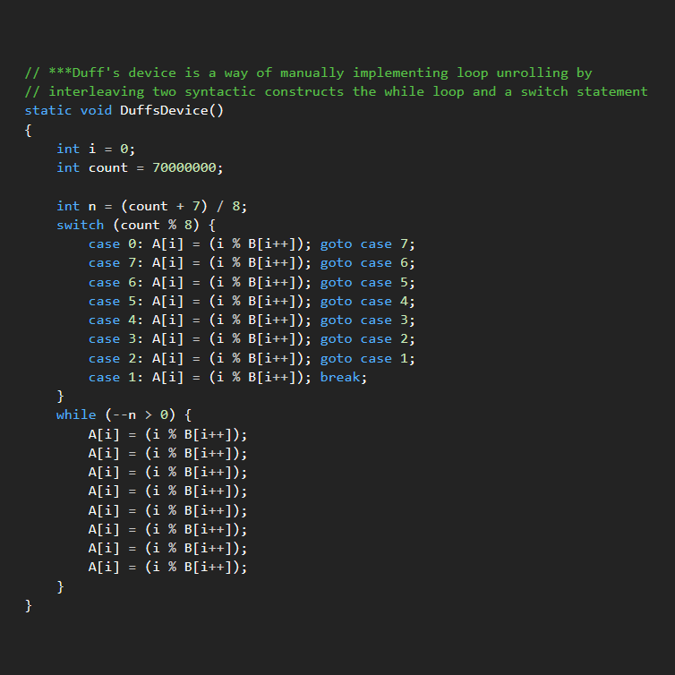
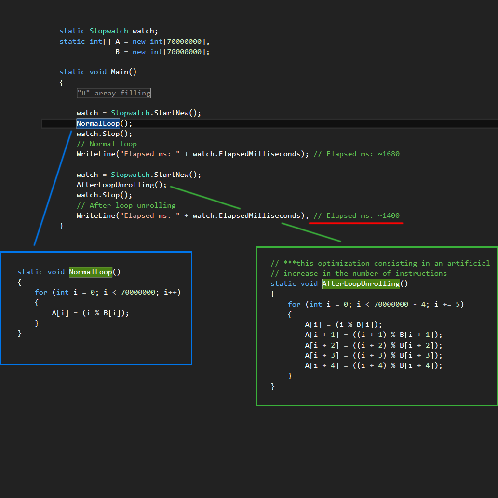

## Loop unrolling

Duff's device is a way of manually implementing loop unrolling by interleaving two syntactic constructs the while loop and a switch statement

* I also tried to implement a functionally equivalent version of the Duff's device in C#.
C# excludes some possibilities in a "switch" statement, unlike C/C++ and hinder the best implementation.

## Demonstration:

