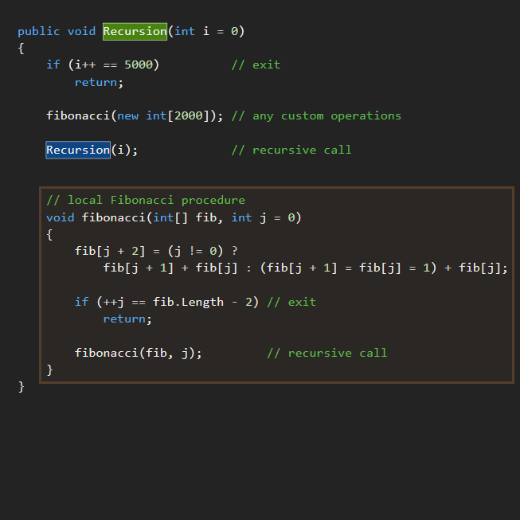
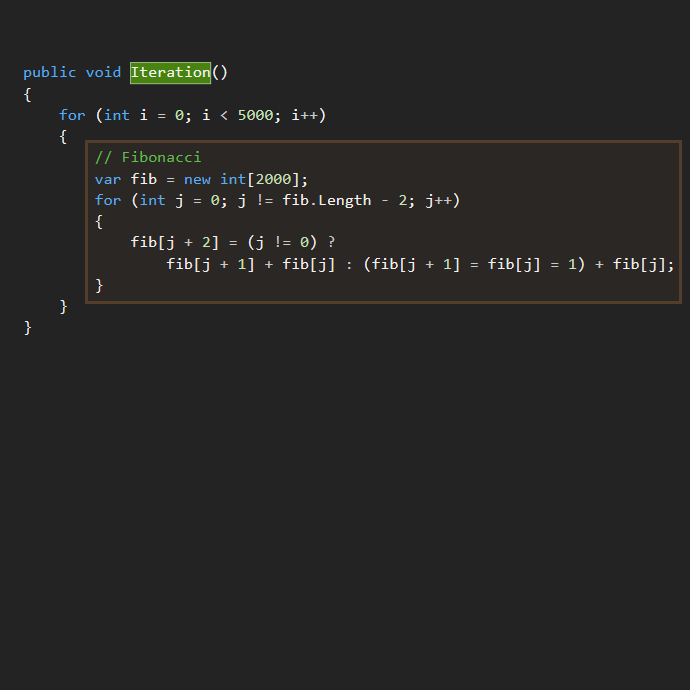

## Recursive call vs. Iterative call

"Recursive" call (without tail optimization) consumes the stack and is can be of causing stack overflow in contrast to "Iterative" call which doesn't consume the stack.
___

### Demonstration of effectiveness: ###

#### Recursion implementation ####

#### Iterative implementation ####

