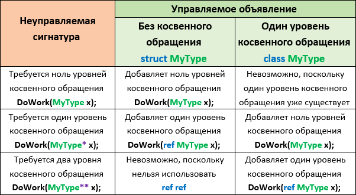
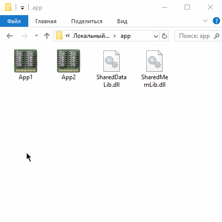

# "Маршалинг взаимодействия"

#### Содержание: ####

[Обращение к низкоуровневым dll-библиотекам](https://github.com/sharpist/C_Sharp/blob/master/Marshaling/Marshaling.md#Обращение-к-низкоуровневым-dll-библиотекам)

[Маршализация типов](https://github.com/sharpist/C_Sharp/blob/master/Marshaling/Marshaling.md#Маршализация-типов)

[Маршализация классов/структур](https://github.com/sharpist/C_Sharp/blob/master/Marshaling/Marshaling.md#Маршализация-классовструктур)

* [Правила выравнивания](https://github.com/sharpist/C_Sharp/blob/master/Marshaling/Marshaling.md#Правила-выравнивания)

* [Рекомендации по объявлению вызовов неуправляемого кода](https://github.com/sharpist/C_Sharp/blob/master/Marshaling/Marshaling.md#Рекомендации-по-объявлению-вызовов-неуправляемого-кода)

[Маршализация параметров in и out](https://github.com/sharpist/C_Sharp/blob/master/Marshaling/Marshaling.md#Маршализация-параметров-in-и-out)

[Обратные вызовы (Callback) из неуправляемого кода](https://github.com/sharpist/C_Sharp/blob/master/Marshaling/Marshaling.md#Обратные-вызовы-callback-из-неуправляемого-кода)

[Эмуляция объединения C](https://github.com/sharpist/C_Sharp/blob/master/Marshaling/Marshaling.md#Эмуляция-объединения-c)

[Разделяемая память](https://github.com/sharpist/C_Sharp/blob/master/Marshaling/Marshaling.md#Разделяемая-память)

[Отображение структуры на неуправляемую память](https://github.com/sharpist/C_Sharp/blob/master/Marshaling/Marshaling.md#Отображение-структуры-на-неуправляемую-память)

[Взаимодействие с COM](https://github.com/sharpist/C_Sharp/blob/master/Marshaling/Marshaling.md#взаимодействие-с-com)

* [Основы системы типов COM](https://github.com/sharpist/C_Sharp/blob/master/Marshaling/Marshaling.md#основы-системы-типов-com)

* [Обращение к компоненту COM из C#](https://github.com/sharpist/C_Sharp/blob/master/Marshaling/Marshaling.md#обращение-к-компоненту-com-из-c)

[Языковые улучшения COM](https://github.com/sharpist/C_Sharp/blob/master/Marshaling/Marshaling.md#языковые-улучшения-com)

* [Необязательные параметры и именованные аргументы](https://github.com/sharpist/C_Sharp/blob/master/Marshaling/Marshaling.md#необязательные-параметры-и-именованные-аргументы)

* [Неявные параметры ref](https://github.com/sharpist/C_Sharp/blob/master/Marshaling/Marshaling.md#неявные-параметры-ref)

* [Индексаторы](https://github.com/sharpist/C_Sharp/blob/master/Marshaling/Marshaling.md#индексаторы)

* [Динамическое связывание](https://github.com/sharpist/C_Sharp/blob/master/Marshaling/Marshaling.md#динамическое-связывание)

[...](https://github.com/)
_______________________________________________________________________________
## Обращение к низкоуровневым dll-библиотекам
_______________________________________________________________________________

Для обеспечения интеграции с неуправляемыми dll-библиотеками предусмотрены
службы вызова функций платформы, образующие технологию ```P/Invoke```, которая
позволяет задействовать функции, структуры и обратные вызовы в dll-библиотеках.

Пространство имён ```System.Runtime.InteropServices```.

Например, в dll-библиотеке ```user32.dll``` определена функция ```MessageBox```:
```
int MessageBox(
    HWND    hWnd,
    LPCTSTR lpText,
    LPCTSTR lpCaption,
    UINT    uType
);
```
Данную функцию можно вызвать напрямую.

Объявляется одноименный статический метод с внешней реализацией (при применении
служб взаимодействия для вызова неуправляемого кода модификатор ```extern```
используется с атрибутом ```DllImport```):
```c#
using System;
using System.Runtime.InteropServices;

class Program
{
    public static void Main() =>
        MessageBox(IntPtr.Zero, "Текст", "Заголовок", 0);


    // используется метод MessageBox из библиотеки user32.dll
    [DllImport("user32.dll")]
    public static extern int MessageBox(
        IntPtr hWnd,
        string text,
        string caption,
        int    type
    );
}
```
#### Маршализатор транслирует параметры и возвращаемые значения между типами .NET и неуправляемыми типами. ####

В примере параметры ```int``` преобразуются в четырёхбайтовые целые числа, строковые
 – в массивы двухбайтовых символов Unicode, завершающиеся символом ```null```.
Структура ```IntPtr``` инкапсулирует неуправляемый дескриптор.

Подобное поведение свойственно классам из пространств имён ```System.Windows``` и
```System.Windows.Forms```, которые свободно вызывают неуправляемые методы.
_______________________________________________________________________________
## Маршализация типов
_______________________________________________________________________________

#### На неуправляемой стороне требуемый тип данных может быть представлен разными способами. ####

Строка может содержать однобайтовые символы ANSI или двухбайтовые – Unicode,
начинаться префиксным значением длины и завершаться ```null```, или быть фиксированной
длины.

Поэтому, чтобы маршализатор CLR провёл корректную трансляцию, применяется
атрибут ```MarshalAs```:
```c#
[DllImport("*.dll")]
public static extern int Foo(
    [MarshalAs(UnmanagedType.LPStr)]
    string s
);
```
*перечисление ```UnmanagedType``` содержит все поддерживаемые маршализатором типы


#### На управляемой стороне .NET доступен подобный выбор относительно применяемого типа данных. ####

Неуправляемый дескриптор может отображаться на типы ```IntPtr```, ```int```, ```uint```, ```long``` и
```ulong```.
Дескрипторы, инкапсулирующие указатель или адрес, отображаются на ```IntPtr``` для
совместимости с ОС.

#### Важное отличие составляет необходимость выполнения ряда процессов управления памятью при получении строк обратно из неуправляемого кода в .NET. ####

Тем не менее, маршализатор берёт это на себя, когда внешний метод в качестве
параметра ожидает объект типа ```StringBuilder```, вместо ```string```:
```c#
using System;
using System.Runtime.InteropServices;
using System.Text;

class Program
{
    public static void Main()
    {
        var sb = new StringBuilder(256);
        GetWindowsDirectory(sb, 256);
        Console.WriteLine(sb); // C:\WINDOWS
    }


    [DllImport("kernel32.dll")]
    public static extern int GetWindowsDirectory(
        StringBuilder sb, int maxChars
    );
}
```
_______________________________________________________________________________
## Маршализация классов/структур
_______________________________________________________________________________

Когда в неуправляемый метод требуется передавать в качестве параметра класс или
структуру, например, как тип ```LPSYSTEMTIME``` в методе ```GetSystemTime```:
```c
typedef struct _SYSTEMTIME {
    WORD wYear;
    WORD wMonth;
    WORD wDayOfWeek;
    WORD wDay;
    WORD wHour;
    WORD wMinute;
    WORD wSecond;
    WORD wMilliseconds;
} SYSTEMTIME, *PSYSTEMTIME;
```
*эквивалентно структуре в C

Необходимо определить соответствующий класс или структуру .NET прямо в
управляемом коде, установив атрибут ```StructLayout```, который укажет маршализатору
способ отображения каждого поля на его неуправляемый эквивалент при помощи
перечисления ```LayoutKind```, определяющего предустановленное поведение размещения
для управляемых классов и структур:

```Sequential``` – поля размещаются в порядке отображения при экспорте, выравниваясь
последовательно по границам размеров пакета, в соответствии с компоновкой,
заданной в свойстве ```Pack``` и могут быть несмежными.

```Explicit``` – точное положение каждого поля объекта в неуправляемой памяти
управляется явно в соответствии с настройкой свойства ```Pack```.

```c#
[StructLayout(LayoutKind.Sequential)]
class SystemTime
{
    public ushort Year;
    public ushort Month;
    public ushort DayOfWeek;
    public ushort Day;
    public ushort Hour;
    public ushort Minute;
    public ushort Second;
    public ushort Milliseconds;
}
```

Пример 1:
```c#
using System;
using System.Runtime.InteropServices;

[StructLayout(LayoutKind.Sequential)]
class SystemTime
{
    public ushort Year;
    public ushort Month;
    public ushort DayOfWeek;
    public ushort Day;
    public ushort Hour;
    public ushort Minute;
    public ushort Second;
    public ushort Milliseconds;
}

class Program
{
    public static void Main()
    {
        var t = new SystemTime();
        GetSystemTime(t);
        Console.WriteLine(t.Year); // 2018
    }


    [DllImport("kernel32.dll")]
    public static extern void GetSystemTime(
        SystemTime t
    );
}
```

Свойство ```Pack``` задаёт выравнивание полей данных класса или структуры в памяти.
Поддерживаются следующие значения размера пакета: 0, 1, 2, 4, 8, 16, 32, 64 или
128 (где 0 – значение по умолчанию равное 8 байтам).

Для оптимизации операций доступа в C и C# все поля в объекте размещаются со
смещением в ```n``` байтов, кратным размеру каждого поля, начиная с адреса объекта.

Таким образом, в C имя поля непосредственно компилируется в смещение, в
качестве маркера для представления чего либо по адресу экземпляра типа плюс
взятое смещение, тогда как в C# среда CLR находит смещение применяя маркер поля.

Но из-за ограничения размерности стандартного пакета 8 байтами резервируемая
длина, скажем, структуры, содержащей ```sbyte``` и ```long``` (8 байтов) составит не
ожидаемые 9 байтов, а 16 байтов из которых 7 байтов останутся без нагрузки!

Потери можно минимизировать или устранить задав размер пакета через свойство
```Pack``` в атрибуте ```StructLayout``` – обеспечив выравнивание по смещениям, кратным
выбранному размеру пакета.

При однобайтовом размере пакета, результирующая резервируемая структурой длина
составит 9 байтов.

### Правила выравнивания: ###

1. По умолчанию выравнивание типа – есть размер его наибольшего элемента
(1, 2, 4, 8 и т.д. байтов) или указанный размер пакета, в зависимости от того,
что меньше.

2. Каждое поле необходимо согласовать с полями собственного размера
(1, 2, 4, 8 и т.д. байтов) или c выравниванием типа, в зависимости от того, что
меньше. Поскольку по умолчанию выравнивание типа – есть размер его наибольшего
элемента, это обычно означает, что поля выравниваются по их размеру.

Даже если наибольшее поле в типе является 64-разрядным (8-байтовое) целым
числом или установлен эквивалентный размер пакета в 8 байтов: байтовые поля
выравниваются по однобайтовым границам, ```Int16``` (2-байтовое) выравниваются по
двухбайтовым границам, а ```Int32``` (4-байтовое) выравниваются по четырёхбайтовым
границам.

3. Заполнение добавляется между полями для соответствия требованиям
выравнивания.

Например, структура, состоящая из двух байтовых полей и одиного поля ```Int32```:
```c#
struct Struct
{
    public byte B1, B2;
    public int  I3;
}
```
Если используется размер пакета по умолчанию, тогда величина структуры вмещает
8 байтов. Пара байтовых полей займёт первые два байта памяти, потому что байты
должны выравниваться по однобайтовым границам.

Поскольку выравнивание по умолчанию этого типа входит в 4 байта, то есть размер
его наибольшего из полей – ```I3```, дополнено два байта заполнения, за которым
следует целочисленное поле:
```c#
using System;
using System.Runtime.InteropServices;

[StructLayout(LayoutKind.Sequential, Pack = 0)]
struct Struct
{
    public byte B1, B2;
    public int  I3;
}

class Program
{
    public unsafe static void Main()
    {
        var st = new Struct();
        // указатель на адрес экземпляра типа
        byte* addr = (byte*)&st;

        Console.WriteLine($"Struct size   {sizeof(Struct)} bytes");
        Console.WriteLine($"B1     offset {&st.B1 - addr} bytes");
        // 0x000000cb999edb11 - 0x000000cb999edb10 = 1
        Console.WriteLine($"B2     offset {&st.B2 - addr} bytes");
        Console.WriteLine($"I3     offset {(byte*)&st.I3 - addr} bytes");
    }
}
// Output:
// Struct size   8 bytes
// B1     offset 0 bytes
// B2     offset 1 bytes
// I3     offset 4 bytes
```
Если выбран двухбайтовый пакет, тогда размер структуры составляет 6 байтов. Пара
байтовых полей займёт первые два байта памяти.

Поскольку поля теперь выравниваются по двухбайтовым границам, нет заполнения
между вторым байтом и целым числом:
```c#
...

[StructLayout(LayoutKind.Sequential, Pack = 2)]
struct Struct
{
    public byte B1, B2;
    public int  I3;
}

...
// Output:
// Struct size   6 bytes
// B1     offset 0 bytes
// B2     offset 1 bytes
// I3     offset 2 bytes
```


### Рекомендации по объявлению вызовов неуправляемого кода: ###

Так как структуры представляют собой типы значений, а классы – ссылочные типы,
в классах изначально реализовано не менее одного уровня косвенного обращения к
памяти (указатель на значение).

#### Важное отличие, поскольку неуправляемые функции часто используют косвенное обращение. ####



* если неуправляемая функция не требует косвенного обращения, необходимо
использовать структуру, передаваемую по значению.
* если неуправляемая функция требует один уровень косвенного обращения,
необходимо использовать передаваемую по ссылке структуру или передаваемый по
значению класс.
* если неуправляемая функция требует два уровня косвенного обращения, необходимо
использовать класс, передаваемый по ссылке.

Пример 2:
```c#
using System;
using System.Runtime.InteropServices;

[StructLayout(LayoutKind.Sequential)]
struct SystemTime
{
    public ushort Year;
    public ushort Month;
    public ushort DayOfWeek;
    public ushort Day;
    public ushort Hour;
    public ushort Minute;
    public ushort Second;
    public ushort Milliseconds;
}

class Program
{
    public static void Main()
    {
        var t = new SystemTime();
        GetSystemTime(ref t);
        Console.WriteLine(t.Year); // 2018
    }


    [DllImport("kernel32.dll")]
    // неуправляемой функции требуется
    // один уровень косвенного обращения
    public static extern void GetSystemTime(
        ref SystemTime t
    );
}
```
В модифицированном примере класс был заменён на структуру, поскольку вызываемой
неуправляемой функции требуется один уровень косвенного обращения, структура
должна передаваться по ссылке.
_______________________________________________________________________________
## Маршализация параметров ```in``` и ```out```
_______________________________________________________________________________

Семантика направленных параметров C# действует равноценно и с внешними методами:

передаваемые по значению и ```in```, ```ref``` и ```in/out```, ```out``` и ```out```.

Типы, запрашивающие копирования при выводе из функции (классы массивов и класс
```StringBuilder```), являются – ```in/out```.
Через атрибуты ```In``` и ```Out``` допускается управление подобным характером.

Например, атрибут ```In``` выставит массив только на чтение, указав, что в функцию
передаётся копия массива и выводиться из не будет:
```c#
[DllImport("*.dll")]
public static extern void Foo(
    [In] int[] array
);
```
_______________________________________________________________________________
## Обратные вызовы (Callback) из неуправляемого кода
_______________________________________________________________________________

В C# дополнительно к вызовам методов C реализованы обратные вызовы из функций C,
через неуправляемые указатели на функции отображаемые на аналог – делегаты C#. 
Уровень ```P/Invoke``` предоставляет отображение между сопряжёнными конструкциями на
обеих сторонах.

Например, библиотека ```user32.dll``` включает функцию ```EnumWindows```, которая
перечисляет значения дескриптора для каждого окна верхнего уровня на экране
локального компьютера и передаёт дескриптор каждого окна в определяемую
программой функцию обратного вызова (просматривает список окон).

Функция ```EnumWindows``` задействует обратный вызов – ```WNDENUMPROC``` и действует пока
последнее окно верхнего уровня не будет перечислено, либо пока функция
обратного вызова не вернёт ```false```.

```EnumWindows``` имеет следующую сигнатуру:
```c
BOOL EnumWindows(
    WNDENUMPROC lpEnumFunc, // указатель на функцию обратного вызова
    LPARAM      lParam
);
```
Признак обратного вызова – префикс ```lp``` (long pointer) и суффикс ```Func``` в имени
параметра ```lpEnumFunc```, который принимает указатель на функцию обратного вызова.

В качестве неуправляемой функции обратного вызова выступает функция
```EnumWindowsProc```, которая принимает дескриптор окна верхнего уровня в результате
вызова функции ```EnumWindows```:
```c
BOOL CALLBACK EnumWindowsProc(
    HWND   hwnd,  // дескриптор родительского окна
    LPARAM lParam // определяемое программой значение
);
```

Пример:
```c#
using System;
using System.Runtime.InteropServices;
// делегат совпадает по сигнатуре с обратным вызовом
public delegate bool EnumWindowsCallback(IntPtr hWnd, IntPtr lParam);

class Program
{
    public static void Main() =>
        EnumWindows(PrintWindow, IntPtr.Zero);
    // управляемая функция обратного вызова
    static bool PrintWindow(IntPtr hWnd, IntPtr lParam)
    {
        Console.WriteLine(hWnd.ToInt64());
        return true;
    }

    
    [DllImport("user32.dll")]
    // использовать внешнюю реализацию
    public static extern int EnumWindows(
        // псевдоним PrintWindow
        EnumWindowsCallback hWnd, IntPtr lParam
    );
}
```
Сборщик мусора не освобождает делегат в течение всего вызова и, следовательно,
до завершения выполнения функции обратного вызова, которая завершает свою
работу, прежде чем весь вызов (неуправляемый код) возвратит управление
управляемой стороне.

В исключительных случаях, когда функция обратного вызова может быть вызвана
после возвращения вызова, необходимо выполнить действия, гарантирующие, что
делегат не будет уничтожен преждевременно.
_______________________________________________________________________________
## Эмуляция объединения C
_______________________________________________________________________________

Обычно в структуре выделяется достаточно места каждому полю для хранения данных.
Например, в структуре данных, состоящей только из одного поля типа ```int``` и ещё
одоного поля типа ```char```, ```int```, первое в группе, размещается на смещении 0 и
занимает 4 байта, тогда как ```char``` начнётся со смещения 4 и займёт 2 байта:
```c#
[StructLayout(LayoutKind.Sequential, Pack = 2)]
// длина структуры 6 байтов
struct Struct
{
    public int  I1; // смещение 0
    public char C2; // смещение 4
}
```
Редкое исключение, когда намеренно поле типа ```char``` начнётся со смещения 2, тогда
присваивание значения изменит также и поле типа ```int``` – структура "объединение"
доступная в C.

Значение ```LayoutKind.Explicit``` и атрибут ```FieldOffset``` позволяют заведомо
эмулировать объединение в C#.

#### Объединение выгодно при ряде побитовых операций преобразования байтов. ####

Например, в составе библиотеки ```winmm.dll``` хранится функция ```midiOutShortMsg```,
используемая при воспроизведении нот средствами MIDI протокола с внешнего
синтезатора.

Функция ```midiOutShortMsg``` имеет следующую сигнатуру:
```c
MMRESULT midiOutShortMsg(
   HMIDIOUT hmo,  // дескриптор ключ MIDI-потока
   DWORD    dwMsg // короткое MIDI-сообщение в упакованном виде
);
```
Объявление одноименного статического метода с внешней реализацией:
```c#
[DllImport("winmm.dll")]
public static extern uint midiOutShortMsg(
    IntPtr handle,
    uint   message
);
```
Второй аргумент – ```message```, описывает, какую ноту требуется продуцировать.
Это 32-битное целое число без знака, конструктивно разделённое на байты,
представляющие MIDI канал, ноту и скорость звучания.

Процесс осуществляется сдвигом и применением масок через побитовые операции ```<<```,
```>>```, ```&```, ```|``` для преобразования байтов в и из 32-битного "упакованного" формата.

Идентичную конвертацию можно производить через объединение, определив структуру
с явной компоновкой:
```c#
using System;
using System.Runtime.InteropServices;

[StructLayout(LayoutKind.Explicit)]
// длина структуры 4 байта
struct NoteMessage
{
    [FieldOffset(0)] public uint PackedMsg;
    // совмещённое смещение
    [FieldOffset(0)] public byte Channel;
    [FieldOffset(1)] public byte Note;
    [FieldOffset(2)] public byte Velocity;
}

class Program
{
    public static void Main()
    {
        var n = new NoteMessage();
        Console.WriteLine(n.PackedMsg); // 0

        n.Channel  = 10;  // 0000 1010
        n.Note     = 100; // 0110 0100
        n.Velocity = 50;  // 0011 0010
        Console.WriteLine(n.PackedMsg);
        // 0011 0010  0110 0100  0000 1010 => 3302410

        n.PackedMsg = 3328010;
        Console.WriteLine(n.PackedMsg);
        // 0011 0010 [1100 1000] 0000 1010 => 3328010
        Console.WriteLine(n.Note);
        // [1100 1000] => 200
    }
}
```
Поля ```Channel```, ```Note``` и ```Velocity``` специально пересекаются с 32-битным упакованным
сообщением. Таким образом, без избыточных вычислений и синхронизации полей
возможны чтение и запись данных в целевые адресуемые области памяти, используя
либо то, либо другое.
_______________________________________________________________________________
## Разделяемая память
_______________________________________________________________________________

Разделяемая память (размещение в памяти совместно используемых данных) –
специальная функциональность Windows, позволяющая процессам на одном компьютере
совместно использовать данные без избыточных затрат.

Разделяемая память обладает исключительным быстродействием, предоставляя, в
отличие от каналов, произвольный доступ к совместно используемым данным.

Уровень ```P/Invoke``` эффективно развёртывает эксплуатацию размещённых в расширенной
памяти файлов, посредством прямого вызова методов API-интерфейса Win32.

Функция ```CreateFileMapping``` выделяет разделяемую память заданного размера байтов
и идентифицируемую по наименованию.
Затем остальная группа приложений контекста может подписаться на задействованную
разделяемую память, вызвав функцию ```OpenFileMapping``` с необходимым именем.
Указанные функции возвращают дескриптор, преобразуемый в указатель с помощью
функции ```MapViewOfFile```.

Пример класса, инкапсулирующего доступ к разделяемой памяти:
```c#
using System;
using System.ComponentModel;
using System.Runtime.InteropServices;

namespace SharedMemLib
{
    public sealed class SharedMem : IDisposable
    {
        // перечисления безопаснее констант
        enum FileProtection : uint // константы из winnt.h
        {
            ReadOnly  = 2,
            ReadWrite = 4
        }
        enum FileRights : uint     // константы из WinBASE.h
        {
            Read  = 4,
            Write = 2,
            ReadWrite = Read + Write
        }


        static readonly IntPtr NoFileHandle = new IntPtr(-1);


        [DllImport("kernel32.dll", SetLastError = true)]
        static extern IntPtr CreateFileMapping(
            IntPtr         hFile,
            int            lpAttributes,
            FileProtection flProtect,
            uint           dwMaximumSizeHigh,
            uint           dwMaximumSizeLow,
            string         lpName
        );

        [DllImport("kernel32.dll", SetLastError = true)]
        static extern IntPtr OpenFileMapping(
            FileRights dwDesiredAccess,
            bool       bInheritHandle,
            string     lpName
        );

        [DllImport("kernel32.dll", SetLastError = true)]
        static extern IntPtr MapViewOfFile(
            IntPtr     hFileMappingObject,
            FileRights dwDesiredAccess,
            uint       dwFileOffsetHigh,
            uint       dwFileOffsetLow,
            uint       dwNumberOfBytesToMap
        );

        [DllImport("kernel32.dll", SetLastError = true)]
        static extern bool UnmapViewOfFile(IntPtr map);

        [DllImport("kernel32.dll", SetLastError = true)]
        static extern int CloseHandle(IntPtr hObject);


        IntPtr fileHandle, fileMap;
        public IntPtr Root { get { return fileMap; } }


        public SharedMem(string name, bool existing, uint sizeInBytes)
        {
            if (existing)
                fileHandle = OpenFileMapping(FileRights.ReadWrite, false, name);
            else
                fileHandle = CreateFileMapping(
                    NoFileHandle, 0, FileProtection.ReadWrite, 0, sizeInBytes, name
                );

            if (fileHandle == IntPtr.Zero) throw new Win32Exception();
            // отображение с возможностью чтения/записи для всего файла
            fileMap = MapViewOfFile(fileHandle, FileRights.ReadWrite, 0, 0, 0);

            if (fileMap == IntPtr.Zero) throw new Win32Exception();
        }

        public void Dispose()
        {
            if (fileMap != IntPtr.Zero) UnmapViewOfFile(fileMap);
            if (fileHandle != IntPtr.Zero) CloseHandle(fileHandle);
            fileMap = fileHandle = IntPtr.Zero;
        }
    }
}
```
*методам с внешней реализацией выставлен ```SetLastError``` для выдачи кодов ошибок и
заполнения сведениями исключения ```Win32Exception```

Демонстрация работы двух приложений, взаимодействующих с данными через
разделяемую память. Структура данных определена в библиотеке классов dll:
```c#
using System;
using System.Text;

namespace SharedDataLib
{
    [Serializable] public struct SharedData
    {
        public String Message
        {
            get { return UnicodeEncoding.Unicode.GetString(message); }
            set { message = UnicodeEncoding.Unicode.GetBytes(value); }
        }
        byte[] message;
    }
}
```
Первое приложение выделяет разделяемую память – создаёт объект типа ```SharedMem```,
передавая в качестве аргументов имя и значение ```false```:
```c#
unsafe
{
    using (var sm = new SharedMem("MyShare", false, 1280))
    {
        // открыть доступ к разделяемой памяти
        IntPtr root = sm.Root;
        byte* BytePtr = (byte*)root.ToPointer();


        // поднять лимит ReadLine
        // 254 символа 256 байт буфер - 2 байта CR/LF
        var bufferSize = 500;
        Console.SetIn(TextReader.Synchronized(
            new StreamReader(
                Console.OpenStandardInput(bufferSize),
                Console.InputEncoding,
                false, bufferSize, true
            )));
        // получить данные
        var d = new SharedData { Message = Console.ReadLine() };
        // сериализировать
        using (var ms = new MemoryStream())
        {
            IFormatter formatter = new BinaryFormatter();
            formatter.Serialize(ms, d);

            // записать в неуправляемый блок памяти
            var ums = new UnmanagedMemoryStream(
                BytePtr,
                ms.Length,
                ms.Length,
                FileAccess.Write
            );
            ums.Write(ms.ToArray(), 0, (int)ms.Length);
            ums.Close();
        }
        // ждать приложение-компаньон
        Console.ReadKey(true);
        /// <summary> не применяется
        /// выделение блока неуправляемой памяти и возврат объекта IntPtr
        /// IntPtr root = Marshal.AllocHGlobal(message.Length);
        /// освобождение блока неуправляемой памяти
        /// Marshal.FreeHGlobal(root);
        /// </summary>
    }
}
```
Второе приложение подписывается на разделяемую память:
```c#
unsafe
{
    using (var sm = new SharedMem("MyShare", true, 1280))
    {
        // открыть доступ к разделяемой памяти
        IntPtr root = sm.Root;
        byte* BytePtr = (byte*)root.ToPointer();


        // читать из неуправляемого блока памяти
        var ums = new UnmanagedMemoryStream(
            BytePtr,
            1280
        );
        ums.Seek(0, SeekOrigin.Begin);
        // десериализировать
        IFormatter formatter = new BinaryFormatter();
        var d = (SharedData)formatter.Deserialize(ums);
        ums.Close();

        // вывести данные в консоль
        Console.WriteLine(d.Message);

        // ждать приложение-компаньон
        Console.ReadKey(true);
    }
}
```
Каждая из программ получает ```IntPtr``` указатель на общую неуправляемую память.
Используя взаимный указатель приложения способны коллективно записывать и
считывать данные из памяти:



В конкретной реализации выполняется построение сериализируемого типа, который
инкапсулирует разделяемые данные и сериализирует/десериализирует данные в
неуправляемую память с применением класса ```UnmanagedMemoryStream```.

Данный способ действует для небольших объёмов данных, более выгодно определение
конструкции разделяемых данных в виде структуры и её отображение на разделяемую
память.
_______________________________________________________________________________
## Отображение структуры на неуправляемую память
_______________________________________________________________________________

Структуре, отображаемой на неуправляемую память, задаётся атрибут ```StructLayout```
с установленным значением ```Sequential``` или ```Explicit```:
```c#
[StructLayout(LayoutKind.Sequential)]
// длина структуры 208 байтов
unsafe struct SharedData
{
    public int  Value;
    public char Letter;
    // массив, а не ссылка на него
    public fixed float Numbers[50];
}
```
Здесь директива ```fixed``` определяет массив типа значения фиксированной длины,
размещаемый непосредственно – пространство в структуре для 50 значений типа
```float``` выделяется встроенным образом. Ссылка на фиксированный массив отсутствует,
используется указатель и при индексации выполняется арифметика над указателем.

Размер структуры ```SharedData``` 208 байтов:
4 байта поле ```Value``` типа ```int```, 2 байта поле ```Letter``` типа ```char```, 200 байтов поле
```Numbers``` типа ```float``` (50 значений по 4 байта) и 2 байта добавлено заполнение,
поскольку выравнивание по умолчанию этого типа входит в 4 байта.

Использование структуры ```SharedData``` в контексте небезопасного кода на примере
памяти, выделенной в стеке:
```c#
unsafe
{
    SharedData d;
    SharedData* data = &d; // извлечь адрес 'd'

    data->Value  = 123;
    data->Letter = 'X';
    data->Numbers[10] = 1.45F;
}
```
Эквивалентное выделение в стеке блока памяти, размер которого позволяет
сохранить 1 элемент типа ```SharedData```:
```c#
unsafe
{
    SharedData* data = stackalloc SharedData[1];

    data->Value  = 123;
    data->Letter = 'X';
    data->Numbers[10] = 1.45F;
}
```
Подобные операции можно также производить в управляемом контексте, однако,
опять же, может оставаться условие предотвращения высвобождения памяти и
уничтожения объекта в управляемой куче, то есть хранить экземпляр ```SharedData``` в
неуправляемой куче, за пределами действия сборщика мусора CLR.
В таком случае, указатели действительно становятся актуальны:
```c#
unsafe
{
    SharedData* data = (SharedData*)
        // выделить память в неуправляемой куче
        Marshal.AllocHGlobal(sizeof(SharedData)).ToPointer();

    data->Value  = 123;
    data->Letter = 'X';
    data->Numbers[10] = 1.45F;
    // освободить память
    Marshal.FreeHGlobal(new IntPtr(data));
}
```

Демонстрация работы двух приложений, взаимодействующих с данными через
разделяемую память, посредством определения разделяемых данных в виде структуры
и её отображения на неуправляемую память.

Первое приложение выделяет разделяемую память – создаёт объект типа ```SharedMem```,
передавая в качестве аргументов имя и значение ```false```:
```c#
unsafe
{
    using (var sm = new SharedMem("MyShare", false, 1280))
    {
        void* root = sm.Root.ToPointer();
        // отображение структуры
        SharedData* data = (SharedData*)root;

        data->Value  = 123;
        data->Letter = 'X';
        data->Numbers[10] = 1.45F;
        Console.WriteLine("Записано в разделяемую память.");
        Console.ReadKey(true);

        Console.WriteLine("Value:       " + data->Value);
        Console.WriteLine("Letter:      " + data->Letter);
        Console.WriteLine("Numbers[10]: " + data->Numbers[10]);
        Console.ReadKey(true);
        // после выхода из оператора using объект
        // разделяемой памяти высвобождается
    }
}
```
Разрешается вывести из обращения класс ```SharedMem``` задействовав – 
```MemoryMappedFile```:
```c#
unsafe
{
    using (var mmFile =
        MemoryMappedFile.CreateNew("MyShare", 1280))
    using (var accessor = mmFile.CreateViewAccessor())
    {
        byte* pointer = null;
        accessor.SafeMemoryMappedViewHandle.AcquirePointer(ref pointer);
        void* root = pointer;
        ...
    }
}
```
Второе приложение подписывается на разделяемую память:
```c#
unsafe
{
    using (var sm = new SharedMem("MyShare", true, 1280))
    {
        void* root = sm.Root.ToPointer();
        // отображение структуры
        SharedData* data = (SharedData*)root;

        Console.WriteLine("Value:       " + data->Value);
        Console.WriteLine("Letter:      " + data->Letter);
        Console.WriteLine("Numbers[10]: " + data->Numbers[10]);
        Console.ReadKey(true);

        // обновить данные в разделяемой памяти
        data->Value++;
        data->Letter = '!';
        data->Numbers[10] = 987.5F;
        Console.WriteLine("Обновленна разделяемая память.");
        Console.ReadKey(true);
    }
}
```
Совместный доступ к разделяемой памяти небезопасен относительно потоков
(и процессов), поэтому к полям ```Value``` и ```Letter``` должен применяться модификатор
```volatile```, исключающий поля из оптимизации компилятора для доступа только одного
потока и отменяющий их кэширование в регистрах процессора так, чтобы каждое
могло быть изменено несколькими потоками, выполняемыми одновременно, с учётом
временных записей, любого другого потока, в порядке выполнения.

Доступ к полям с особым обращением подлежит синхронизации межпроцессным
объектом ```Mutex```, либо другим соответствующим примитивом синхронизации
межпроцессорной синхронизации.


### Важная особенность: ###

#### Отображение структуры на неуправляемую память ограничено возможностью отображаемой структуры включать только неуправляемые типы с выделением пространства встроенным образом. ####

По этой причине для строковых данных необходимо задействовать конвертацию в
фиксированный массив символов:
```c#
using System;
using System.Runtime.InteropServices;

[StructLayout(LayoutKind.Sequential)]
unsafe struct SharedData
{
    // 200 символов (400 байтов)
    const int messageSize = 200;

    public String Message
    {
        // закрепить встроенную структуру в рамках кучи, чтобы
        // итерироваться по содержимому через указатели в память
        get { fixed (char* cp = message) return new String(cp); }
        set
        {
            fixed (char* cp = message)
            {
                int i = 0;
                for ( ; i < value.Length && i < messageSize - 1; i++)
                    cp[i] = value[i];
                // добавить терминальный нуль-символ
                cp[i] = '\0';
            }
        }
    }
    // выделить пространство встроенным образом
    fixed char message[messageSize];
}
```
Независимо от того, что структура ```SharedData``` исполняется в неуправляемом
контексте и, следовательно, не перемещается в неуправляемой памяти, случайно
или преднамеренно она может находить применение аналогично в управляемом
контексте – компилятор требует указывать ```fixed```, чтобы сделать код ```unsafe```
безопасным также и в управляемом контексте.

Сложные типы можно сериализировать, но длина сириализированных данных не должна
превышать выделенное пространство в структуре.
_______________________________________________________________________________
## Взаимодействие с COM
_______________________________________________________________________________

В исполняющую среду .NET интегрировано развитое взаимодействие с объектами COM,
как в самой .NET, так и наоборот.

```Component Object Model``` – двоичный стандарт для API-интерфейсов, обеспечивающий
возможности межкомпонентного взаимодействия, независимые от языка и версий,
путём отделения спецификации типа от его реализации через интерфейс COM.

### Основы системы типов COM: ###

В .NET реализация может изменяться без перекомпиляции вызывающих сборок,
платформа выполняет развязку, освобождая реализацию от интерфейса.

Таким образом, любой тип можно объявить без его интерфейса:
```c#
public class Foo
{
    public string Test() => "Hello World!";
}
```
Потребители типа ```Foo``` вызывают метод ```Test``` напрямую.
Модификация реализации метода ```Test``` и добавление перегруженных версий не нарушат
работу вызывающих компонентов.

#### В COM типы открывают свою функциональность только через интерфейсы. ####

То есть, подобный уровень развязки обязывает тип ```Foo``` открывать свой функционал
через интерфейс. Вызывающие компоненты будут задействовать функциональность
типа ```Foo``` не напрямую, а через интерфейс ```IFoo```.

Для добавления перегруженной вирсии метода ```Test``` потребуется обеспечить
реализацию классом ```Foo``` другого интерфейса – ```IFoo2```, который вводит новую
сигнатуру и предоставляет доступ к новой версии соответствующему вызывающему
компоненту, тогда как предыдущая версия по прежнему останется доступной своему
потребителю через первоначальный интерфейс, по следующим причинам:
* технология COM не поддерживает перегрузку методов.
* в COM опубликованные интерфейсы являются неизменяемыми.
* перестростроение введённого интерфейса ```IFoo``` недостижима без нарушения
двоичной совместимости с предыдущей версией.

#### Создание версий библиотек COM укладывается в множественное поддержание интерфейсов. ####

Интерфейсы COM идентифицируются при помощи GUID. Каждый COM-объект обязан
реализовывать корневой интерфейс – ```IUnknown```, состоящий из методов:
* ```AddRef``` и ```Release``` управляют временем жизни, так как COM работает с неуправляемым
кодом, где невозможна автоматическая сборка мусора.
* ```QueryInterface``` пытается получить указатель на заданный интерфейс из COM-объекта.

COM-объект также может реализовывать интерфейс ```IDispatch``` для поддержки
динамического программирования.

### Обращение к компоненту COM из C#: ###

Для доступа к COM-объектам не требуется явным образом работать с интерфейсами
```IUnknown``` и ```IDispatch```, вместо этого используются объекты CLR.

Все обращения к COM маршализируются исполняющей средой, через посредник – 
вызываемые оболочки времени выполнения RCW (runtime-callable wrapper), основная
функция которых состоит в маршалинге вызовов между клиентом .NET и COM-объектом.

Оболочка RCW скрывает различия между управляемыми и неуправляемыми моделями
программирования.

Для осуществления подобного перехода, оболочка RCW открывает доступ к методам,
свойствам и событиям из используемых интерфейсов, реализуемых COM-объектом,
задействуя вспомогательные COM-интерфейсы изолированно от клиента .NET.


Также нет необходимости, для управления временем жизни, явно задействовать
методы ```AddRef``` и ```Release```, среда выполнения берёт это на себя. Кроме
того, среда выполнения выполняет преобразования примитивных типов между .NET и
COM.

Среда выполнения создает по одной вызываемой оболочке времени выполнения для
каждого COM-объекта, независимо от числа управляемых клиентов .NET содержащих
ссылки на этот COM-объект.

Среда выполнения поддерживает одну вызываемую оболочку времени выполнения на
процесс для каждого объекта.

Если вызываемая оболочка времени выполнения создана в конкретном домене
приложения и затем передаётся ссылка в другой домен приложения – используется
посредник для первого объекта.


Принятый статически типизированный способ доступа к оболочкам RCW проводят типы
взаимодействия COM – сгенерированные прокси-типы, которые открывают доступ к
члену .NET для каждого члена COM.

Типы взаимодействия COM генерируются инструментом импорта библиотек типов на
основе выбранной библиотеки COM и компилируются в сборку взаимодействия COM.
```
           г е н е р а ц и я            к о м п и л я ц и я
                /     \                       /     \
  БИБЛИОТЕКА COM       ТИПЫ ВЗАИМОДЕЙСТВИЯ COM       СБОРКА ВЗАИМОДЕЙСТВИЯ COM
(библиотека типов)
```
Используя метаданные, полученные из библиотеки типов, среда выполнения создаёт
как вызываемый COM-объект, так и оболочку RCW для него.

Если компонент COM реализует одновременно несколько интерфейсов, создаётся
одиночный тип, включающий члены всех интерфейсов.

Каждая вызываемая оболочка времени выполнения содержит кэш указателей
интерфейса на COM-объект, для которого она используется, и освобождает ссылку
на COM-объект, когда оболочка RCW больше не нужна. Среда выполнения выполняет
сборку мусора для оболочки RCW.

Чтобы создать сборку взаимодействия COM необходимо в Visual Studio открыть
менеджер ссылок действием добавить ссылку (add reference) и на вкладке COM
выбрать библиотеку.

Например, добавив ссылку на библиотеку ```Microsoft Excel 12.0 Object Library```
можно взаимодействовать с классами COM для Excel. Так выглядит, на основе
языковых улучшений C# 4.0, свёрнутый код, который создаёт и отображает рабочую
книгу, заполняя в ней ячейку:
```c#
using System;
using Excel = Microsoft.Office.Interop.Excel;

class Program
{
    static void Main()
    {
        var excel = new Excel.Application();
        excel.Visible = true;
        Excel.Workbook workBook = excel.Workbooks.Add();
        excel.Cells[1, 1].Font.FontStyle = "Bold";
        excel.Cells[1, 1].Value2 = "Hello World!";
        workBook.SaveAs(@"d:\temp.xlsx");
    }
}
```
Класс ```Excel.Application``` – тип взаимодействия COM, чьим типом времени выполнения
является RCW. При обращении к свойствам ```Workbooks``` и ```Cells``` имеем ещё больше
типов взаимодействия.

Показанный выше код, в его исходной реализации:
```c#
var missing = System.Reflection.Missing.Value;

var excel = new Excel.Application();
excel.Visible = true;
Excel.Workbook workBook = excel.Workbooks.Add(missing);
var range = (Excel.Range)excel.Cells[1, 1];
range.Font.FontStyle = "Bold";
range.Value2 = "Hello World!";

workBook.SaveAs(@"d:\temp.xlsx",
    missing, missing, missing, missing, missing,
    Excel.XlSaveAsAccessMode.xlNoChange,
    missing, missing, missing, missing, missing
);
```
_______________________________________________________________________________
## Языковые улучшения COM
_______________________________________________________________________________

### Необязательные параметры и именованные аргументы: ###

Так как в COM API-интерфейсы не поддерживают перегрузку методов, большинство
функций имеют множество параметров, в том числе необязательных.
Например, метод ```SaveAs``` рабочей книги Excel:
```c#
var missing = System.Reflection.Missing.Value;
...
workBook.SaveAs(@"d:\temp.xlsx",
    missing, missing, missing, missing, missing,
    Excel.XlSaveAsAccessMode.xlNoChange,
    missing, missing, missing, missing, missing
);
```
Встроенная поддержка необязательных параметров C# учитывает COM и расширяет
их до полной формы. Поэтому, следующий код равнозначен:
```c#
workBook.SaveAs(@"d:\temp.xlsx");
```
Применение дополненительно именованных аргументов позволяет указать отдельные
аргументы внезависимости от позиций:
```c#
workBook.SaveAs(@"d:\temp.xlsx", Password: "foo");
```

### Неявные параметры ref: ###

Для повышения производительности некоторые API-интерфейсы COM открывают доступ
к функциям, объявляющим каждый параметр как передаваемый по ссылке, тем самым,
освобождая от копирования значений аргументов.

Однако, данная особенность препятствовала использованию необязательных
параметров, так как в C# вызовы подобных методов должны содержать модификатор
```ref``` для каждого аргумента:
```c#
object fileName = "foo.doc";
object arg1 = Missing.Value;
object arg2 = Missing.Value;
...
word.Open(ref fileName, ref arg1, ref arg2...);
```
С версии C# 4.0 для вызовов функций COM модификатор ```ref``` можно не указывать, что
позволяет применять необязательные параметры:
```c#
word.Open("foo.doc");
```

### Индексаторы: ###

Вследствие того, что модификатор ```ref``` можно не указывать, индексаторы COM с
параметрами ```ref``` доступны через стандартные индексаторы C#, которые не
поддерживают параметры ```ref/out```.

Развитие взаимодействия с индексаторами позволяет обращаться к свойствам COM,
которые принимают аргументы.

Пример демонстрирует свойство ```Foo```, принимающее целочисленный аргумент:
```c#
myComObject.Foo[123] = "Hello";
```
Подобные свойства в C# не разрешены. Тип должен открывать доступ к индексатору
только на самом себе. Пример индексирования экземпляра типа:
```c#
myNetObject[123] = "Hello";
```
Следовательно, чтобы создать код на C#, разрешающий данное обращение, свойство
```Foo``` обязано было бы возвращать другой соответственный индексируемый тип,
открывающий доступ к стандартному индексатору.

### Динамическое связывание: ###

