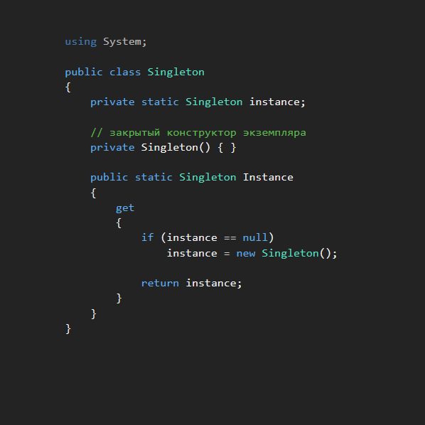
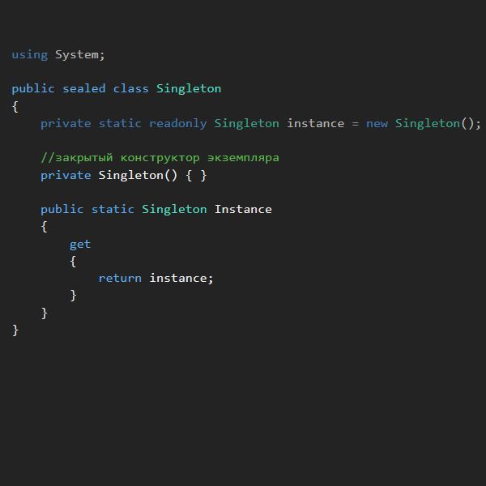
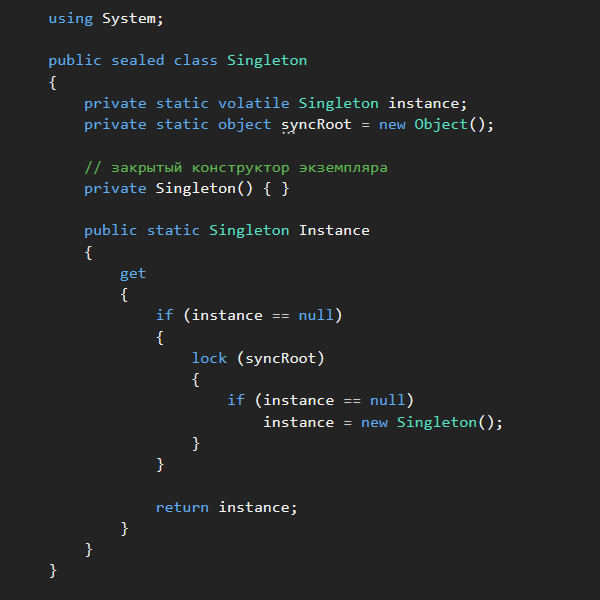

#				Patterns
_________________________________________________________________________________________
#### Содержание: ####

[Singleton](https://github.com/sharpist/C_Sharp/tree/master/Patterns#singleton)

...

_________________________________________________________________________________________

#				Singleton
```
Класс, должен иметь только один экземпляр, при этом необходимо обеспечить:
* глобальную точку доступа к экземпляру
* потокобезопасность
```
Представлен сравнительно простой моделью с различными вариантами реализации.


### Стратегии реализации: ###


#### Singleton ####



Эта реализация имеет два основных преимущества:
1. Поскольку экземпляр создается внутри метода свойства экземпляра, класс может выполнять
дополнительные функции (например, создавать экземпляр подкласса), даже если это может
привести к нежелательным зависимостям.

2. Создание экземпляра не выполняется до тех пор, пока объект не запросит экземпляр;
этот подход называется отложенным созданием экземпляра или "ленивым экземпляром".

Отложенное создание экземпляров позволяет избежать создания ненужных синглетов при
запуске приложения.

Основным недостатком этой реализации является то, что она небезопасна для многопоточных
сред. Если отдельные потоки выполнения выполнят метод свойства экземпляра одновременно,
может быть создано несколько экземпляров Singleton.
Каждый поток может выполнить следующую инструкцию решив, что нужно создать новый
экземпляр:
```
if (instance == null)
```


#### Static Initialization ####

В этой стратегии экземпляр создается при первом обращении к любому члену класса.
Инициализация переменной выполняется средой CLR.



Класс помечен как sealed (запечатанный), чтобы предотвратить вывод, который может
добавлять экземпляры. Кроме того, переменная помечена как readonly, что означает, что
её можно назначить только во время статической инициализации (используется в примере)
или в конструкторе класса.

Эта реализация аналогична предыдущему примеру, за исключением того, что для
инициализации переменной используется среда CLR.
По-прежнему реализуются две основные задачи, которые пытается решить шаблон Singleton:
глобальный доступ и управление экземплярами.
```
Свойство public static предоставляет глобальную точку доступа к экземпляру. Кроме того,
поскольку конструктор является закрытым, экземпляр Singleton класса нельзя создать за
пределами самого класса; поэтому переменная ссылается на единственный экземпляр,
который может существовать в системе.
```
Поскольку на экземпляр Singleton ссылается закрытая статическая переменная-член,
создание экземпляра не происходит до тех пор, пока на класс не будет ссылаться вызов
свойства Instance. Таким образом, это решение реализует форму свойства отложенного
создания экземпляра, как в шаблоне проектирования Singleton.

Единственным потенциальным недостатком этого подхода является меньший контроль над
механикой создания экземпляра. В шаблонах проектирования можно было использовать
конструктор по умолчанию или выполнять другие задачи перед созданием экземпляра.
Поскольку .NET Framework выполняет инициализацию в этом решении, эти параметры
отсутствуют.
В большинстве случаев статическая инициализация является предпочтительным подходом
для реализации Singleton в .NET.


#### Multithreaded Singleton ####



