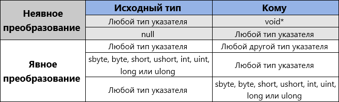

# Типы указателей
_________________________________________________________________________________________
В небезопасном контексте тип может быть типом указателя, типом значения или ссылочным
типом.
Объявления типа указателя выполняется одним из следующих способов:
```
type* identifier;
void* identifier; // допустимо, но не рекомендуется
```
В объявлении нескольких указателей знак ```*``` ставится у базового типа:
```
int* p1;
int* p2, p3;
// int *p2, *p3; // недопустимо
```

Тип, указанный до ```*``` в типе указателя, называется ссылочным типом. Ссылочным может быть
любой из указанных ниже типов:

* целочисленный тип: ```sbyte```, ```byte```, ```short```, ```ushort```, ```int```, ```uint```, ```long```, ```ulong```.

* тип с плавающей запятой: ```float```, ```double```.

* ```char```.

* ```bool```.

* ```decimal```.

* ```enum```.

* любой тип указателя (например выражения, такие как ```void**```).

* пользовательский тип структуры, содержащий поля неуправляемых типов.

Типы указателей не наследуются от объекта, упаковка- распаковка-преобразование не
поддерживают указатели.
#### Указатель не может указывать на ссылку или на структуру, содержащую ссылки, поскольку ####
#### ссылка на объект может быть подвергнута сбору мусора, даже если на неё указывает ####
#### указатель. ####

#### Объявления типов указателей: ####

* ```int* p```, где ```p``` – указатель на целое число.

* ```int** p```, где ```p``` – указатель на указатель на целое число.

* ```int*[] p```, где ```p``` – одномерный массив указателей на целые числа.

* ```char* p```, где ```p``` – указатель на тип char.

* ```void* p```, где ```p``` – указатель на неизвестный тип.

Оператор косвенного обращения указателя ```*``` можно использовать для доступа к содержимому,
на которое указывает переменная-указатель ```int* myVariable```:
```
...
// в myVariable содержится адрес на переменную int
Console.WriteLine(*myVariable); // вывод хранящегося значения
```

#### Пример инкрементирования внутреннего указателя: ####



*для указателя типа ```void*``` использовать оператор косвенного обращения нельзя. Однако можно
использовать приведение для преобразования указателя типа ```void``` в любой другой тип и
наоборот.
Указатель может иметь значение ```null```.
Чтобы избежать неопределённости при передаче указателей между методами
рекомендуется использовать метод, возвращающий указатель в локальную переменную с помощью
параметра ```in```, ```out``` или ```ref``` либо в виде результата функции.
!!! Если указатель был задан в фиксированном блоке (fixed), переменная, на которую он
указывает, больше не может быть фиксированной.

#### Операторы, которые можно использовать с указателями: ####

* ```*``` – косвенное обращение к указателю.

* ```->``` – доступ к члену структуры через указатель.

* ```[]``` – индексирование указателя.

* ```&``` – получение адреса переменной.

* ```++``` и ```--``` – увеличение и уменьшение указателей.

* ```+``` и ```-``` – арифметические действия с указателем.

* ```==```, ```!=```, ```<```, ```>```, ```<=``` и ```>=``` – сравнение указателей.

* ```stackalloc``` – выделение памяти в стеке.

* оператор ```fixed``` – временная фиксация переменной, чтобы можно было найти её адрес.
