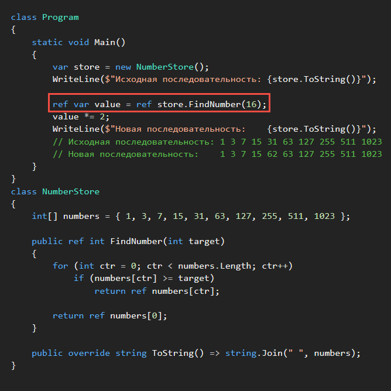
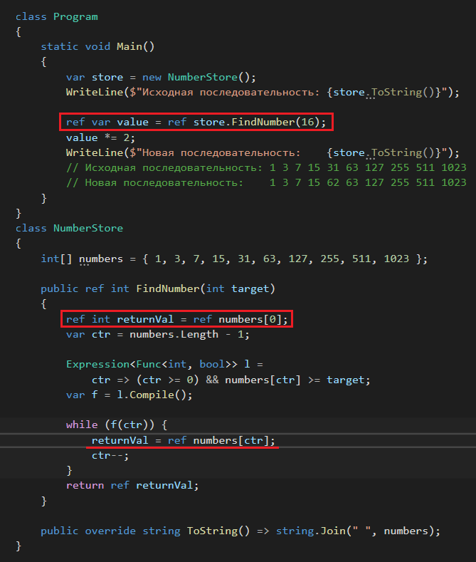

# Возвращаемые ссылочные значения и ссылочные локальные переменные
_________________________________________________________________________________________
## Возвращаемые ссылочные значения ##

```
Возвращаемое ссылочное значение позволяет методу вернуть вызывающей стороне ссылку на
переменную, а не фиксированное значение.
```
Вызывающая сторона может обработать полученную переменную как если бы она возвращалась
по значению или по ссылке, например, создать новую переменную и присвоить ей ссылку на
полученное значение – ```локальная ссылочная переменная```.

```Возвращаемое ссылочное значение``` означает, что метод возвращает ссылку на некоторую
переменную (или её псевдоним).
Этот метод должен входить в область действия переменной.
Время существования переменной должно продолжаться после того, как метод возвратит
управление.
Все изменения, производимые вызывающей стороной с возвращаемым значением метода,
применяются к возвращённой переменной.

Если для метода объявлено возвращаемое ссылочное значение, значит он возвращает – 
```псевдоним переменной```, с помощью которого вызывающий код получает доступ к этой
переменной и может её измененить.
_________________________________________________________________________________________
#### Ограничения возвращаемых ссылочных значений: ####

* время существования возвращаемого значения должно превышать период выполнения метода
(нельзя возвращать ссылку на локальную переменную вызываемого метода).

* возвращаемое значение не может быть литералом ```null```.
(может быть псевдонимом для переменной с текущим значением ```null``` или типом, допускающим
значение ```null```).

* возвращаемое значение не может быть константой, элементом перечисления, полученным по
значению, возвращаемым значением свойства, а также методом class или struct.

* возвращаемые ссылочные значения недопустимы в асинхронных методах.
(асинхронный метод может вернуть управление до того, как будет завершено его выполнение и
станет известно его возвращаемое значение).

#### Определение возвращаемого ссылочного значения: ####
Добавить ключевое слово ```ref``` к типу возвращаемого значения в сигнатуре метода:
```c#
public ref Person GetContactInformation(string fname, string lname)
{
    /*реализация метода*/
    return ref p;
}
```

#### Использование возвращаемого ссылочного значения: ####
Возвращаемое ссылочное значение является псевдонимом для другой переменной в области
вызываемого метода.
Любое применение возвращаемого ссылочного значения можно рассматривать как применение
псевдонима соответствующей переменной.

1. Присваивая новое значение псевдониму, это значение присваивается переменной, на
которую он ссылается.

2. Считывая значение псевдонима, извлекается значение переменной, на которую он
ссылается.

3. Возвращая псевдоним по ссылке, возвращается новый псевдоним для той же переменной.

4. Передавая псевдоним другому методу по ссылке, передаётся ссылка на переменную, на
которую ссылается псевдоним.

5. Создавая для псевдонима локальную ссылочную переменную, создаётся новый псевдоним
для той же переменной.
_________________________________________________________________________________________
## Ссылочные локальные переменные ##

Для метода ```GetContactInformation``` объявлено возвращаемое ссылочное значение.
```c#
public ref Person GetContactInformation(string fname, string lname)
{
    /*реализация метода*/
    return ref p;
}
```
При назначении по значению (отсутствует ключевое слово ```ref```) извлекается значение
переменной и присваивается полученное значение новой переменной ```p```:
```c#
Person p = contacts.GetContactInformation("Brandie", "Best");
```

* в предыдущем назначении ```p``` объявлена как локальная переменная.

* исходное значение копируется из значения, которое возвращает ```GetContactInformation```.

* все последующие назначения ```p``` не затронут значения переменной, которую возвращает
```GetContactInformation```.

* переменная ```p``` теперь не является псевдонимом для возвращаемой переменной.

#### Объявление ```локальной ссылочной переменной``` и сохранение в ней псевдонима для ####
#### исходного значения: ####
В следующем назначении ```p``` является псевдонимом для переменной, возвращаемой из
```GetContactInformation```.
```c#
ref Person p = ref contacts.GetContactInformation("Brandie", "Best");
```

* ```p``` действует так же, как и возвращаемая из ```GetContactInformation``` переменная, так как ```p```
является псевдонимом для этой переменной.

* любые изменения ```p``` затрагивают и переменную, возвращаемую из ```GetContactInformation```.

* ключевое слово ```ref``` используется перед объявлением локальной переменной и до вызова
метода.
_________________________________________________________________________________________
#### Подобным образом можно обращаться к значению по ссылке: ####
В некоторых случаях обращение к значению по ссылке повышает производительность, поскольку
позволяет избежать потенциально затратной операции копирования.
```c#
ref VeryLargeStruct refLocal = ref veryLargeStruct;
```

До версии C# 7.3 ссылочные локальные переменные не переназначались после инициализации
так, чтобы они ссылались на другое хранилище.

Теперь локальные переменные ```ref``` можно переназначить другим экземплярам после
инициализации:
```c#
// инициализация
ref VeryLargeStruct refLocal = ref veryLargeStruct;
// переназначение, refLocal ссылается на другое хранилище
refLocal = ref anotherVeryLargeStruct;
```
*ссылочные локальные переменные необходимо инициализировать во время объявления
_________________________________________________________________________________________

#### Пример: использование возвращаемых ссылочных значений и ссылочных локальных переменных ####

Класс ```NumberStore``` содержит массив целочисленных значений и метод ```FindNumber```, возвращающий
по ссылке первое число, которое не меньше переданного в аргументе значения, иначе
возвращает число с индексом 0.



Метод ```FindNumber``` извлекает первое значение не меньше 16. После этого вызывающий объект
удваивает значение, возвращаемое методом.
Изменение отражается в значении элементов массива в экземпляре ```NumberStore```.

Изменённый метод ```FindNumber``` для использования доступного в C# 7.3 ([C# 7.3](https://github.com/sharpist/C_Sharp/tree/master/7.3#c-73)) переназначения
ссылочной локальной переменной.


