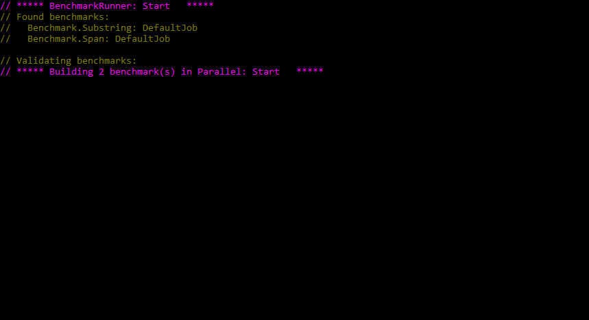

# Benchmark Span

### ```Span<T>``` представлен в C# 7.2 и поддерживается во время выполнения .NET Core 2.1

```Span<T>``` реализует функцию ```Slice``` (нарезку), действительно мощную операцию, при которой
указывается индекс начальной позиции для среза и, необязательно, длина конечной позиции
для среза. Пропуск длины приводит к срезу от начальной позиции до конца диапазона.
Нарезка является недорогой операцией, поскольку вместо копирования, создаётся новый
диапазон, представляющий окно в подмножестве существующего диапазона памяти.

* производительность замерялась с помощью ```BenchmarkDotNet``` версии 0.10.14

Для сравнения брались два теста, каждый из которых использовал свой метод в ```NameParser```.
Запускались потенциально разные версии кода, одна из которых использовала ```Substring```, а
другая – ```Span<T>```.

## Benchmark:



Выполнение тестов дало следующие результаты на конкретной машине…

``` ini

BenchmarkDotNet=v0.10.14, OS=Windows 10.0.17134
AMD Phenom(tm) II X4 945 Processor, 1 CPU, 4 logical and 4 physical cores
  [Host]     : .NET Framework 4.6.1 (CLR 4.0.30319.42000), 64bit RyuJIT-v4.7.3132.0
  DefaultJob : .NET Framework 4.6.1 (CLR 4.0.30319.42000), 64bit RyuJIT-v4.7.3132.0


```
|    Method |    StdDev |       Min |       Max |    Median | Iterations |
|---------- |----------:|----------:|----------:|----------:|-----------:|
| Substring | 0.6681 ns | 124.17 ns | 126.52 ns | 125.11 ns |      14.00 |
|      Span | 0.3999 ns |  71.30 ns |  72.46 ns |  72.12 ns |      15.00 |


Второй по быстродействию результат показал вариант использующий ```Substring``` взамен ```Span<T>```.

Абсолютным победителем, является подход, основанный на ```Span<T>```. Он выполняется почти
вдвое быстрее, чем подход на основе подстрок.

Важно отметить то, что, поскольку выполняется нарезка в Span, чтобы найти позицию фамилии,
а также возвращается Span в качестве выходных данных метода, не произходит выделение
новой строки.
Это отражается на статистике памяти, которая теперь пуста.
