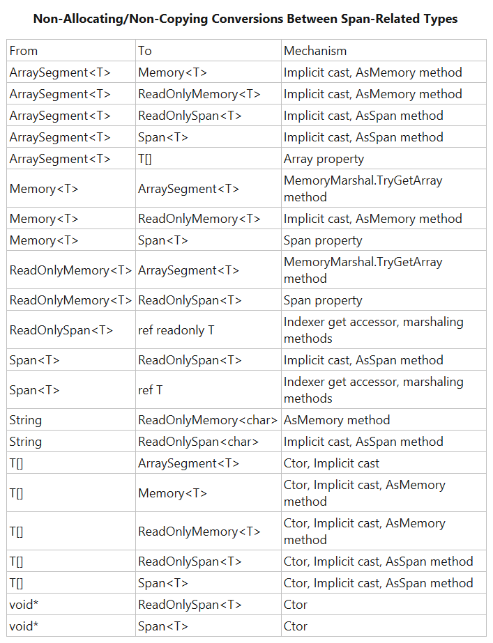

# Span\<T\>
_________________________________________________________________________________________

### В C# 7.2 ([C# 7.2](https://github.com/sharpist/C_Sharp/tree/master/7.2#c-72)) был добавлен тип ```Span<T>```, который позволяет создать коллекцию данных, ###
### хранимую в стеке, но доступ к которой осуществляется по ссылке. ###
_________________________________________________________________________________________

```Span<T>``` является небольшим, но критически важным строительным блоком в огромных
предпринимаемых усилиях по оснащению .NET API для разработки высокопроизводительных
серверных приложений с высокой масштабируемостью.
Тип ```Memory<T>``` является расширением типа ```Span<T>``` и используется для потокобезопасного
доступа по ссылке к коллекции хранимой в стеке.

```System.Span<T>``` – это новый тип значений в основе .NET. Который, делает возможным
представление сопредельных областей произвольной памяти, независимо от того, связана ли
эта память с управляемым объектом, обеспечивается ли она нативным (машинным) кодом,
вызываемым из управляемого кода с помощью Interop или находится в стеке.
При этом сохраняется безопасный доступ с такими эксплуатационными характеристиками, как
характеристики массивов.

В отличие от массивов, он может указывать на управляемую или нативную память, или на
память, выделенную в стеке:
```c#
// managed memory
var arrayMemory = new byte[100];
var arraySpan = new Span<byte>(arrayMemory);

// native memory
var nativeMemory = Marshal.AllocHGlobal(100);
Span<byte> nativeSpan;
unsafe
{
    nativeSpan = new Span<byte>(nativeMemory.ToPointer(), 100);
}
SafeSum(nativeSpan);
Marshal.FreeHGlobal(nativeMemory);

// stack memory
Span<byte> stackSpan = stackalloc byte[100];
SafeSum(stackSpan);
```

#### Таким образом, ```Span<T>``` является абстракцией по всем типам памяти, доступным для .NET-программ: ####
```c#
// не имеет значения с каким видом памяти работает метод
static ulong SafeSum(Span<byte> bytes)
{
    ulong sum = 0;
    for (int i = 0; i < bytes.Length; i++)
        sum += bytes[i];

    return sum;
}
```
_________________________________________________________________________________________

```Span<T>``` реализован только для стека; точнее, это by-ref тип (как и его поле в
быстрой реализации). Это означает, что ```Span``` не может быть упакован, не может
отображаться как поле типа, отличного от стека, и не может использоваться в качестве
обобщённого аргумента.
Однако ```Span<T>``` может использоваться как тип аргументов метода или возвращаемых
значений.

```Span<T>``` поддерживает переинтерпретацию приведения к ```Span<byte>```. Он также
поддерживает небезопасные приведения между произвольными примитивными типами. Причина
этого ограничения заключается в том, что некоторые процессоры не поддерживают эффективный невыровненный
доступ к памяти.

В отличие от ```T[]```, ```Span<T>``` не поддерживает ковариантные приведения, т.е.
приведение ```Span<Subtype>``` к ```Span<Basetype>```, не выполняются проверки ковариации
при хранении ссылок в экземплярах ```Span<T>```.

#### Особенности: ####

1. Принудительное ограничение типа только для стека.

* ```Span<T>``` и ```ReadOnlySpan<T>``` включены в набор встроенных типов только для
стека.

* любая другая структура, содержащая один из них, будет транзитивно считаться типом
только для стека.

* компилятор выдаст ошибку, если тип только для стека используется в запрещенном
контексте, например, используется в качестве аргумента типа, помещённого в кучу
(упаковка, отправка в асинхронный вызов, использование в качестве поля класса и т.д.).

2. Языковая поддержка для закрепления.
```c#
Span<byte> buffer = ...
fixed(byte* pBuffer = buffer)
{
    ...
}
```

3. Синтаксис среза.

* ```Memory<T>```, ```Span<T>``` и ```ReadOnlySpan<T>``` допускают синтаксис среза.

4. Безопасный ```Span<T>``` stackalloc ([stackalloc](https://github.com/sharpist/C_Sharp/tree/master/Stackalloc#stackalloc)).
```c#
void SafeMethod()
{
    Span<byte> buffer = stackalloc byte[128];
    PrimitiveFormatter.TryFormat(buffer, DateTime.Now, ...);
}
```

5. Примитивное ограничение.

* возможность ограничивать параметры типа примитивными типами (которые являются битными),
некоторые операции ```Span<T>``` допустимы только для так называемых аргументов
примитивного типа, например, операция переинтерпретации приведения.
```c#
// операция приведения ограничивает параметры типа
public static Span<U> Cast<T, U>(this Span<T> slice) where T:primitive where U:primitive
{ ... }
```
_________________________________________________________________________________________

При обёртывании массива ```Span<T>``` не ограничивается указанием на первый элемент массива.
Он может указывать на любой поддиапазон. Другими словами, он поддерживает резку:
```c#
var array = new byte[] { 1, 2, 3 };
var slice = new Span<byte>(array, start:1, length:2);
Console.WriteLine(slice[0]); // 2
```
*версия ```Span<T>``` только для чтения – ```ReadOnlySpan<T>``` требуется для представления
срезов неизменяемых и доступных только для чтения структур, например System.String cрезы

Например, создав ```Span<T>``` из массива:
```c#
var arr = new byte[10];
Span<byte> bytes = arr; // неявное приведение из T[] в Span<T>
```
Можно эффективно создать ```Span``` чтобы представить/указать только подмножество этого
массива, используя перегруженный метод ```Span<T>.Slice```.
Затем индексировать полученный результирующий ```Span``` для записи или чтения данных в
соответствующей уместной части исходного массива:
```c#
Span<byte> slicedBytes = bytes.Slice(start: 5, length: 2);
slicedBytes[0] = 42;
slicedBytes[1] = 43;
Assert.Equal(42, slicedBytes[0]);
Assert.Equal(43, slicedBytes[1]);
Assert.Equal(arr[5], slicedBytes[0]);
Assert.Equal(arr[6], slicedBytes[1]);
slicedBytes[2] = 44; // Throws IndexOutOfRangeException
bytes[2] = 45; // OK
Assert.Equal(arr[2], bytes[2]);
Assert.Equal(45, arr[2]);
```

Как уже упоминалось, ```Span``` – это больше, чем просто способ доступа к массивам и их
подмножествам. Они также могут использоваться для ссылки на данные в стеке:
```c#
Span<byte> bytes = stackalloc byte[2]; // C# 7.2 поддержка stackalloc для spans
bytes[0] = 42;
bytes[1] = 43;
Assert.Equal(42, bytes[0]);
Assert.Equal(43, bytes[1]);
bytes[2] = 44; // throws IndexOutOfRangeException
```
В более общем плане они могут использоваться для ссылки на произвольные указатели и
длины, например на память, выделенную из нативной кучи:
```c#
IntPtr ptr = Marshal.AllocHGlobal(1);
try
{
    Span<byte> bytes;
    unsafe { bytes = new Span<byte>((byte*)ptr, 1); }
    bytes[0] = 42;
    Assert.Equal(42, bytes[0]);
    Assert.Equal(Marshal.ReadByte(ptr), bytes[0]);
    bytes[1] = 43; // Throws IndexOutOfRangeException
}
finally { Marshal.FreeHGlobal(ptr); }
```

Индексатор ```Span<T>``` использует преимущество языка C#, представленную в C# 7.0
функциональность, которая называется ```ref returns```.
Индексатор объявляется с возвращаемым типом ```ref T```, который предоставляет семантику,
подобную индексации в массивах, возвращая ссылку на фактическое актуальное расположение
хранилища, вместо возврата копии того, что существует в этом расположении:
```c#
public ref T this[int index] { get { ... } }
```
Влияние этого возвращающего по ссылке индексатора наиболее очевидно путем сравнения его
с индексатором ```List<T>```, который не является возвращающим по ссылке:
```c#
struct MutableStruct { public int Value; }
...
Span<MutableStruct> spanOfStructs = new MutableStruct[1];
spanOfStructs[0].Value = 42;
Assert.Equal(42, spanOfStructs[0].Value);
var listOfStructs = new List<MutableStruct> { new MutableStruct() };
listOfStructs[0].Value = 42; // Error CS1612: the return value is not a variable
```
Второй вариант ```Span<T>```, называемый ```System.ReadOnlySpan<T>```, обеспечивает доступ только
для чтения.
Этот тип похож на ```Span<T>```, за исключением того, что его индексатор поддерживает
преимущество C# 7.2 новую функциональность для возврата ```ref readonly T``` вместо ```ref T```, что
позволяет ему работать с неизменяемыми типами данных, такими как System.String.
```ReadOnlySpan<T>``` делает это очень эффективным для среза строк без выделения или
копирования:
```c#
string str = "hello, world";
string worldString = str.Substring(startIndex: 7, length: 5); // Allocates
ReadOnlySpan<char> worldSpan =
  str.AsSpan().Slice(start: 7, length: 5); // No allocation
Assert.Equal('w', worldSpan[0]);
worldSpan[0] = 'a'; // Error CS0200: indexer cannot be assigned to
```

```Span``` предоставляет множество преимуществ, помимо тех, которые уже упоминались.
Он поддерживает понятие переинтерпретации приведения, то есть возможно использовать
приведение ```Span<byte>``` к ```Span<int>``` (где 0-й индекс в ```Span<int>``` отображает первые четыре
байта ```Span<byte>```).
Таким образом, при чтении буфера байтов, предоставляется возможность передавать методу,
который оперирует с сгруппированными байтами как с значениями типа ```int``` безопасно и
эффективно.
_________________________________________________________________________________________

#### Организация ```Span<T>```: ####

```Span<T>``` – это тип значения, содержащий ссылку и длину, определяемый примерно следующим
образом:
```c#
public readonly ref struct Span<T>
{
    private readonly ref T _pointer;
    private readonly int _length;
    ...
}
```
Концепция поля ```ref T``` может выглядеть странно поначалу, фактически невозможно объявить
поле ```ref T``` в C# или даже в MSIL.
Но ```Span<T>``` на самом деле написан для использования особого внутреннего типа в Runtime,
который рассматривается как just-in-time (JIT) встроенный код, с JIT-генерацией для него
эквивалента поля ```ref T```.

Привычное использование ссылок:
```c#
public static void AddOne(ref int value) => value += 1;
...
var values = new int[] { 42, 84, 126 };
AddOne(ref values[2]);
Assert.Equal(127, values[2]);
```
Здесь код передаёт элемент в массиве по ссылке, так что имеется ```ref T``` в стеке, ```ref T``` в
```Span<T>``` – это та же идея, просто инкапсулированная внутри структуры.
Типы, которые содержат такие ссылки напрямую или косвенно, называются ref-подобными
типами, и компилятор C# 7.2 позволяет объявлять такие ref-подобные типы с помощью
```ref struct``` в сигнатуре.


Отсюда следует:

1. ```Span<T>``` определяется таким образом, что операции могут быть столь же эффективными,
как и в массивах:
индексирование в ```Span``` не требует вычислений для нахождения начала из указателя и его
начального смещения, поскольку само поле ref в себе уже инкапсулирует оба

(напротив, ```ArraySegment<T>``` имеет отдельное поле смещения, что делает его более
дорогостоящим как для индексации, так и для прохождения).

2. Природа ```Span<T>``` как ref-подобного типа несет с собой некоторые ограничения из-за его
поля ```ref T```.

Второй пункт имеет некоторые интересные последствия, вследствие чего .NET содержит второй и связанный набор типов, ведомый ```Memory<T>```.
_________________________________________________________________________________________

# Memory\<T\>

```Span<T>``` – это ref-подобный тип, поскольку он содержит поле ref, а поля ref могут
ссылаться не только на начало объектов, например, таких как массивы, но и на их середину:
```c#
var arr = new byte[100];
Span<byte> interiorRef1 = arr.AsSpan(start: 20);
Span<byte> interiorRef2 = new Span<byte>(arr, 20, arr.Length – 20);
Span<byte> interiorRef3 =
  MemoryMarshal.CreateSpan<byte>(arr, ref arr[20], arr.Length – 20);
```
Эти ссылки называются внутренними указателями, и их отслеживание является относительно
дорогостоящей операцией для сборщика мусора среды выполнения .NET.

Таким образом, среда выполнения ограничивает эти ссылки только для работы в стеке,
поскольку она предусмартивает неявный нижний предел на количество внутренних указателей,
которые могут существовать.

Кроме того, ```Span<T>```, как показано выше, больше, чем размер машинного слова, что означает,
что чтение и запись span не является атомарной операцией. Если несколько потоков
считывают и записывают поля span в куче одновременно, существует риск "разрыва".
Например, предварительно уже инициализированный span содержит действующую ссылку и
соответствующую длину ```_length``` равную 50.
Если первый поток начнёт записывать новый span поверх него и дойдёт до записи нового
значения указателя ```_pointer```. Прежде чем он сможет установить соответствующую длину
```_length``` в 20, второй поток может считывать span, включая обновлённый ```_pointer```, но старый
(и более длинный).


#### В результате экземпляры ```Span<T>``` могут находиться только в стеке, а не в куче: ####

1. Это означает, что не допускается упаковка span (и, следовательно, невозможно использовать
```Span<T>``` с существующими API-интерфейсами вызова отражения, например, поскольку они
требуют упаковки).

2. Это также означает, что невозможно иметь поля ```Span<T>``` в классах или даже в не
ref-подобных структурах. Не допускается использовать span в тех местах, где они могут
неявно становиться полями в классах, например, путем захвата их в лямбда-выражения или
в качестве локальных участников в асинхронных методах или итераторах.

3. Это также приводит к тому, что запрещено использовать ```Span<T>``` в качестве обобщённого
универсального аргумента, поскольку экземпляры этого типа аргумента могут оказаться в
упаковке или иным образом сохранены в куче (в настоящее время нет ограничения
```where T : ref struct```).

Эти ограничения несущественны для многих сценариев, в частности для функций
вычислительной и синхронной обработки. Однако асинхронные функции уже другая история.
Большинство упомянутых проблем, связанных с массивами, срезами массивов, нативной
памятью и другие, существуют независимо от того, связаны ли они с синхронными или
асинхронными операциями.


Таким образом, если ```Span<T>``` не может быть сохранен в куче и, следовательно, не может
быть сохранен в асинхронных операциях, каково решение? Решение – ```Memory<T>```.

```Memory<T>``` очень похож на ```ArraySegment<T>```:
```c#
public readonly struct Memory<T>
{
    private readonly object _object;
    private readonly int _index;
    private readonly int _length;
    ...
}
```

```Memory<T>``` можно создать из массива, используя так же, как и span его зрезы, но это будет
не ref-подобная структура и способная существовать в куче.

Затем, когда потребуется выполнить синхронную обработку, можно от него получить ```Span<T>```:
```c#
static async Task<int> ChecksumReadAsync(Memory<byte> buffer, Stream stream)
{
    int bytesRead = await stream.ReadAsync(buffer);
    return Checksum(buffer.Span.Slice(0, bytesRead));
    // Or buffer.Slice(0, bytesRead).Span
}
static int Checksum(Span<byte> buffer) { ... }
```

Как и в случае ```Span<T>``` и ```ReadOnlySpan<T>```, ```Memory<T>``` имеет эквивалент только для чтения – 
```ReadOnlyMemory<T>```. И, как и следовало ожидать, свойство ```Span``` возвращает ```ReadOnlySpan<T>```.


Краткий обзор встроенных механизмов преобразования между этими типами:



Следует заметить, что поле ```_object``` в ```Memory<T>``` не является строго типизированным как ```T[]```;
точнее, оно хранится как объект. Это означает, что ```Memory<T>``` может обёртывать объекты,
отличные от массивов, например подобные ```System.Buffers.OwnedMemory<T>```.

```OwnedMemory<T>``` – это абстрактный класс, который может использоваться для обёртывания
данных, жизненный цикл которых должен быть постоянно строго управляемым, например, такой,
как память, извлеченная из пула.
Это более сложная тема здесь не рассматривается, но именно таким образом можно
использовать ```Memory<T>```, например, для обёртывания (переноса, конвертации) указателей в
машинную память.

```ReadOnlyMemory<char>``` может также использоваться со строками, так же как может
```ReadOnlySpan<char>```.
_________________________________________________________________________________________

#### Особенности интеграции ```Span<T>``` и ```Memory<T>``` с библиотеками .NET: ####

В предыдущем фрагменте кода ```Memory<T>``` можно заметить вызов ```Stream.ReadAsync```, в который
передаётся ```Memory<byte>```.
Но ```Stream.ReadAsync``` в .NET сегодня определяется для восприятия ```byte[]```. Тогда как это
работает?

В поддержку ```Span<T>``` и преемников, добавляются сотни новых участников и типов сквозь .NET.
Многие из которых являются перегрузками существующих основанных на массивах и строках
методов, в то время как другие являются совершенно новыми типами, ориентированными на
определенные специфичные области обработки.

Например, все примитивные типы, такие как простейший тип ```Int32```, теперь имеют перегрузки
метода синтаксического анализа ```Parse```, которые принимают ```ReadOnlySpan<char>``` в дополнение к
существующим перегрузкам, принимающим строки.

В ситуации, когда ожидается строка, содержащая два числа, разделённые запятой (по типу
"123,456"), и требуется произвести парсинг из этих двух чисел. Сегодня допускается
использовать следующий код:
```c#
string input = ...;
int commaPos = input.IndexOf(',');
int first = int.Parse(input.Substring(0, commaPos));
int second = int.Parse(input.Substring(commaPos + 1));
```
Тем не менее, это, приводит к выделению (allocation) двух строк.
Если создаётся чувствительный к производительности код, вероятно, что два строковых
распределения это уже слишком много. Вместо этого, можно написать:
```c#
string input = ...;
ReadOnlySpan<char> inputSpan = input;
int commaPos = input.IndexOf(',');
int first = int.Parse(inputSpan.Slice(0, commaPos));
int second = int.Parse(inputSpan.Slice(commaPos + 1));
```
Используя новые перегрузки метода синтаксического анализа ```Parse``` на основе Span, целиком
вся эта операция выполнена свободной от выделения ресурсов.

Подобные методы синтаксического анализа и форматирования существуют для таких примитивов,
как ```Int32```, вплоть до основных типов, таких как типы ```DateTime```, ```TimeSpan``` и ```Guid```, и даже до
типов более высокого уровня, таких как ```BigInteger``` и ```IPAddress```. Фактически, многие
подобные методы были добавлены через платформу Framework.

От ```System.Random``` до ```System.Text.StringBuilder``` и до ```System.Net.Sockets``` были добавлены
новые перегрузки, чтобы сделать работу с ```{ReadOnly}Span<T>``` и ```{ReadOnly}Memory<T>``` простой
и эффективной.

Некоторые из которых даже несут с собой дополнительные преимущества. Например, ```Stream```
теперь имеет следующий метод:
```c#
public virtual ValueTask<int> ReadAsync(
  Memory<byte> destination,
  CancellationToken cancellationToken = default) { ... }
```
Здесь следует заметить, что в отличие от существующего метода ```ReadAsync```, который
принимает ```byte[]``` и возвращает задачу ```Task<int>```, данная перегрузка не только принимает
```Memory<byte>``` вместо ```byte[]```, но также возвращает обобщённое значение ```ValueTask<int>```,
возвращающее задачу взамен ```Task<int>```.

```ValueTask<T>``` – это структура, которая помогает избежать выделения ресурсов в случаях,
когда предполагается, что асинхронный метод, как ожидается, должен возвращаться
синхронно, и где маловероятно, что мы можем кэшировать завершенную задачу для всех общих
возвращаемых значений.
Например, среда выполнения может кэшировать завершённую задачу ```Task<bool>``` как для
результата ```true```, так и один для результата ```false```, но не может кэшировать четыре миллиарда
объектов типа ```Task``` для всех возможных значений результата ```Task<int>```.

Поскольку, для реализаций ```Stream``` довольно свойственно буферизовать таким способом, когда
производимые вызовы ```ReadAsync```, завершаются синхронно, эта новая перегрузка ```ReadAsync```
возвращает ```ValueTask<int>```.
Это означает, что асинхронные ```Stream``` операции чтения, которые завершаются синхронно,
могут быть полностью освобождены от выделения ресурсов.

```ValueTask<T>``` также используется в других новых перегрузках, например, при перегрузках
```Socket.ReceiveAsync```, ```Socket.SendAsync```, ```WebSocket.ReceiveAsync``` и ```TextReader.ReadAsync```.

Кроме того, существуют места, где ```Span<T>``` позволяет платформе Framework включать методы,
которые в прошлом вызывали проблемы безопасности памяти.
Рассмотрим ситуацию, когда требуется создать строку, содержащую случайно сгенерированное
значение, например, для идентификатора ID некоторого вида.
Сегодня можно создать код, который требует выделения массива ```char```:
```c#
int length = ...;
Random rand = ...;
var chars = new char[length];
for (int i = 0; i < chars.Length; i++)
{
    chars[i] = (char)(rand.Next(0, 10) + '0');
}
string id = new string(chars);
```
Вместо этого можно использовать выделение стека и даже воспользоваться преимуществом
```Span<char>```, чтобы избежать необходимости использования небезопасного кода. Этот подход
также использует преимущество нового строкового конструктора, который принимает
```ReadOnlySpan<char>```, например:
```c#
int length = ...;
Random rand = ...;
Span<char> chars = stackalloc char[length];
for (int i = 0; i < chars.Length; i++)
{
    chars[i] = (char)(rand.Next(0, 10) + '0');
}
string id = new string(chars);
```
Является более экономичным решением, так как достигнуто отсутствие необходимости
выделения кучи, однако по-прежнему требуется копировать в строку данные, которые были
сгенерированы в стеке.
Этот подход также работает только тогда, когда объём требуемого пространства достаточно
небольшой для стека.

Если длина достаточно коротка, например, составляет всего 32 байта, это нормально, но
когда она представляет тысячи байтов, тогда это может легко привести к ситуации
переполнения стека.

Что, если бы имелась возможность непосредственно писать в память строки вместо этого?
```Span<T>``` позволяет это сделать. В дополнение к новому конструктору строки, у строки теперь
также имеется метод ```Create```:
```c#
public static string Create<TState>(
  int length, TState state, SpanAction<char, TState> action) { ... }
...
public delegate void SpanAction<T, in TArg>(Span<T> span, TArg arg);
```
Данный метод реализуется для выделения строки и последующей передачи перезаписываемого
диапазона span, в который можно писать для заполнения содержимого строки во время её
построения.

Важно, что природа только для стека ```Span<T>``` выгодна в этом случае, гарантируя, что span
(который ссылается на внутреннее хранилище строки) перестанет существовать, прежде чем
конструктор строки завершится, лишая возможности использовать span для изменения строки
после завершения построения:
```c#
int length = ...;
Random rand = ...;
string id = string.Create(length, rand, (Span<char> chars, Random r) =>
{
    for (int i = 0; i < chars.Length; i++)
    {
        chars[i] = (char)(r.Next(0, 10) + '0');
    }
});
```
Теперь, не только достигнуто отсутствие необходимости выделения кучи, но также
производится запись напрямую в память строки в куче, а это означает, что избегается
копия, и решается проблема ограничения на размер стека.

Помимо основных типов платформы Framework, получивших новые элементы, разрабатывается
множество новых типов .NET для работы с диапазонами spans для эффективной обработки в
конкретных сценариях.
Например, разработчики, которые хотят создавать высокопроизводительные микросервисы и
веб-сайты с большим объёмом текстовой обработки, могут получить значительный выигрыш в
производительности, если им не придётся кодировать в и декодировать из строк при работе
в UTF-8.

Для поддержки этого добавляются новые типы, такие как ```System.Buffers.Text.Base64```,
```System.Buffers.Text.Utf8Parser``` и ```System.Buffers.Text.Utf8Formatter```.
Которые оперируют с диапазонами spans байтов, что не только позволяет избежать Unicode
кодирования и декодирования, но и позволяет им работать с нативными буферами,
распространёнными на самых низких уровнях различных сетевых стеков:
```c#
ReadOnlySpan<byte> utf8Text = ...;
if (!Utf8Parser.TryParse(utf8Text, out Guid value,
  out int bytesConsumed, standardFormat = 'P'))
    throw new InvalidDataException();
```
Вся эта функциональность предназначена не только для всеобщего пользования; точнее
платформа Framework самостоятельно способна использовать эти новые методы на основе
```Span<T>``` и ```Memory<T>``` для повышения производительности.
Через .NET Core вызовы переключили на использование новых перегрузок ```ReadAsync```, чтобы
избежать лишних выделений.
Парсинг, который выполнялся путём выделения подстрок, теперь использует преимущество
свободного от выделения синтаксического анализа.

Даже нишевые типы, такие как ```Rfc2898DeriveBytes```, вошли в действие, получив преимущество
нового, основанного на ```Span<byte>``` метода ```TryComputeHash``` в
```System.Security.Cryptography.Hash­Algorithm``` для достижения чудовищной экономии на
выделении (байтовый массив за итерацию алгоритма, который может повторяться тысячи раз),
а также и улучшения пропускной способности.

Предоставление не ограничивается на уровне основных библиотек .NET; и продолжается весь
путь вверх по стеку. ASP.NET Core теперь испытывает большую зависимость и сильно завязан
на диапазонах spans, к примеру, с написанным поверх них HTTP-парсером сервера Kestrel.
В будущем, скорее всего, что диапазоны spans будут представлены из открытых
API-интерфейсов на более низких уровнях ASP.NET Core, например, в конвеере обработки
подпрограммного обеспечения.
_________________________________________________________________________________________

