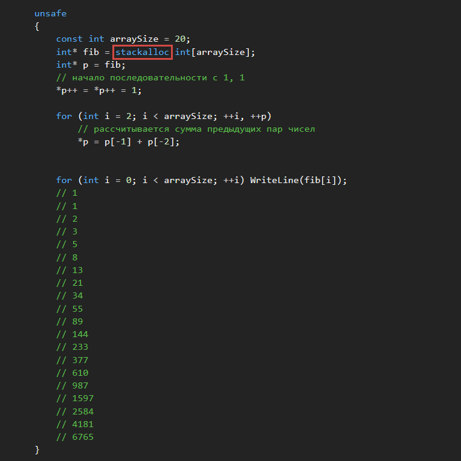

# stackalloc
_________________________________________________________________________________________
#### ```stackalloc``` используетс€ в контексте небезопасного кода дл€ выделени€ блока пам€ти стеку. ####
Ёто ключевое слово допустимо только в инициализаторах локальных переменных:
```
int* block = stackalloc int[100];
```
Ќачина€ с версии C# 7.3 ([C# 7.3](https://github.com/sharpist/C_Sharp/tree/master/7.3#c-73)) дл€ массивов ```stackalloc``` можно использовать синтаксис
инициализатора массива:
```
int* first = stackalloc int[3] { 1, 2, 3 };
int* second = stackalloc int[] { 1, 2, 3 };
int* third = stackalloc[] { 1, 2, 3 };

// битова€ маска задаЄт 1 бит в каждом элементе
int* mask = stackalloc[] {
    0b_0000_0000_0000_0001,
    0b_0000_0000_0000_0010,
    0b_0000_0000_0000_0100,
    0b_0000_0000_0000_1000,
    0b_0000_0000_0001_0000,
    0b_0000_0000_0010_0000,
    0b_0000_0000_0100_0000,
    0b_0000_0000_1000_0000,
    0b_0000_0001_0000_0000,
    0b_0000_0010_0000_0000,
    0b_0000_0100_0000_0000,
    0b_0000_1000_0000_0000,
    0b_0001_0000_0000_0000,
    0b_0010_0000_0000_0000,
    0b_0100_0000_0000_0000,
    0b_1000_0000_0000_0000
};
// 1
// 2
// 4
// 8
...
// 4096
// 8192
// 16384
// 32768
```
“ак как задаютс€ типы указателей ([“ипы указателей](https://github.com/sharpist/C_Sharp/tree/master/Pointer#“ипы-указателей)), ```stackalloc``` требует небезопасного контекста.
Ќебезопасный код менее безопасен, чем безопасные аналоги. ѕри использовании ```stackalloc```
в среде CLR автоматически включаетс€ обнаружение переполнени€ буфера.
_________________________________________________________________________________________

#### ѕример: вычисл€ютс€ первые 20 чисел последовательности ‘ибоначчи ####

¬ этом коде блок пам€ти, размер которого позвол€ет сохранить 20 элементов типа ```int```,
выдел€етс€ не куче (динамическа€ пам€ть), а стеку.

јдрес блока хранитс€ в указателе ```fib```.

Ёта пам€ть не подвергаетс€ сборке мусора и еЄ не нужно закрепл€ть с помощью атрибута
```fixed```.
¬рем€ существовани€ блока пам€ти ограничиваетс€ временем существовани€ метода, который
его определ€ет.


