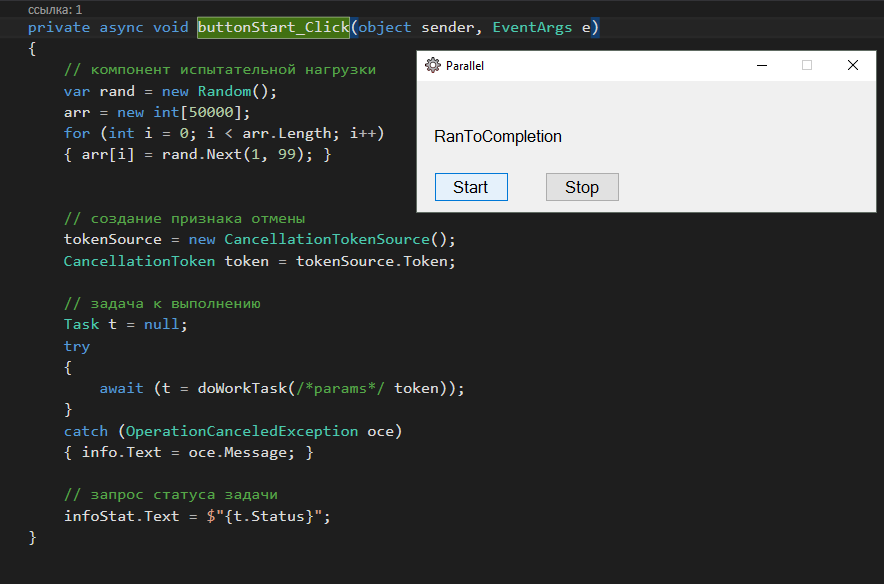
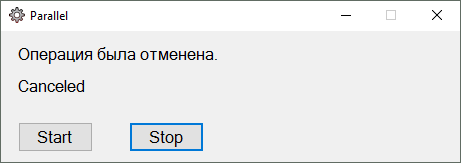

## Async_Method [+Exceptions, +TaskStatus]

## 
## “естовое приложение Parallel:

* работа асинхронного метода с оператором await
* перехват исключени€ OperationCanceledException
* запрос статуса задачи

